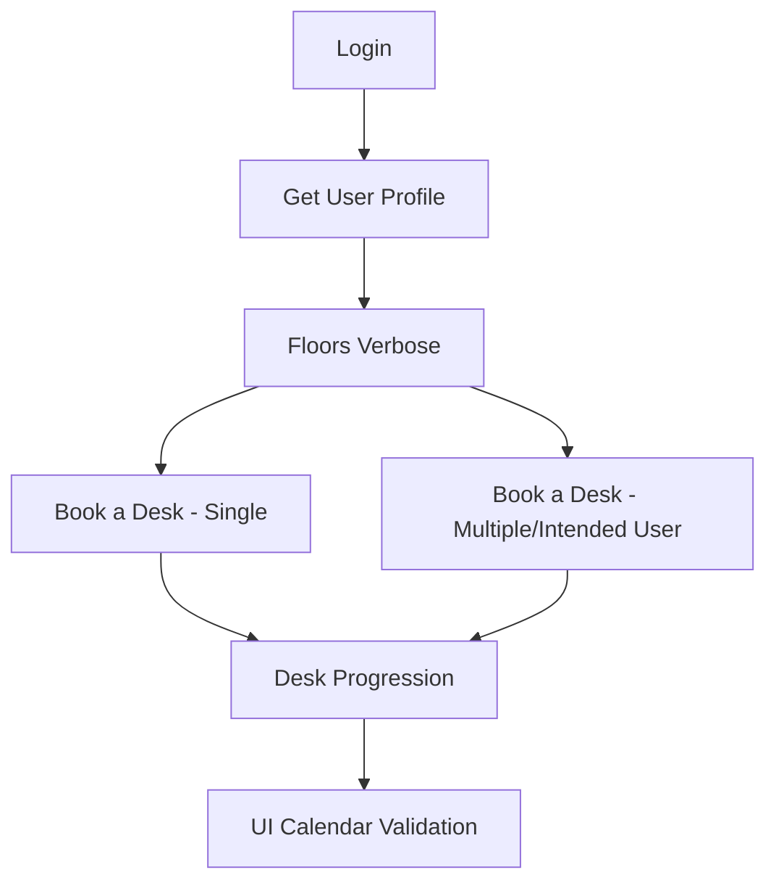

# API Testing

**Prepared for:** Fidelity TAS 5.0 API Validation  
**Tool:** Postman Collection & Environment  

<!-- {docsify-updated} -->

---

## 📘 Objective

This guide documents the **complete flow** for validating TRIRIGA Desk Booking APIs. It provides:

- Step-by-step request sequence
- JSON request/response examples
- Captured variables for chaining requests
- End-to-end validation through UI confirmation

---

## ⚙️ 0. Postman Setup

### 1. Import Postman Environment

**File:** `Tririga Reserve – ENV.postman_environment.json`

- Contains variables: username, password, locationId, userId, etc.

<figure>
  
  <figcaption><strong>Graph:</strong> Environment Variables in Postman</figcaption>
</figure>

### 2. Import Postman Collection

**File:** `DeskBooking.postman_collection.json`

- Contains all API requests in correct order.

<figure>
  
  <figcaption><strong>Graph:</strong> Postman Collection overview</figcaption>
</figure>

---

# 🔑 1. Authentication

```http
GET /tririga/oslc/login?USERNAME={{username}}&PASSWORD={{password}}
```

**Expected:**
- Response: 200 OK
- Cookie: JSESSIONID (required for all subsequent requests)

<figure>
  
  <figcaption><strong>Graph:</strong> successful Login response showing JSESSIONID</figcaption>
</figure>

---

# 👤 2. Get User Profile

```http
GET /tririga/rest/UserProfile
```

**Captured variables:**
- userId → used for bookings
- Default groupId

**Postman Test:**
```javascript
const j = pm.response.json();
pm.environment.set("userId", j.result?.id);
pm.test("UserId captured", () => pm.expect(pm.environment.get("userId")).to.exist);
```

<figure>
  
  <figcaption><strong>Graph:</strong> UserProfile response showing userId</figcaption>
</figure>

---

# 🏢 3. Floors (Verbose)

```http
POST /tririga/rest/FloorsVerbose
```

**Body:**
```json
{
    "locationId": 17692537,
    "pageNumber": 1,
    "pageSize": 100
}
```

**Captured variables:**
- locationId
- floorNumber
- groupId

**Expected:**
- Response: 200 OK
- At least one floor returned

<figure>
  
  <figcaption><strong>Graph:</strong> FloorsVerbose response</figcaption>
</figure>

---

# 🪑 4. Book a Desk – Single Date

```http
POST /tririga/rest/CreateBooking
```

**Body Example:**
```json
{
    "userId": "23514135",
    "deskId": "24212236",
    "bookingType": "Whole Day",
    "dateList": ["2025-08-20"]
}
```

**Expected:**
- Response: 200 OK or 201 Created
- Response contains bookingId

**Postman Test:**
```javascript
const j = pm.response.json();
pm.environment.set("bookingId", j.result?.bookingId);
pm.test("BookingId captured", () => pm.expect(pm.environment.get("bookingId")).to.exist);
```

<figure>
  
  <figcaption><strong>Graph:</strong> response showing bookingId</figcaption>
</figure>

---

# 🪑 4.1 Book a Desk – Intended User & Multiple Dates

```http
POST /tririga/html/en/default/rest/DeskBooking?action=bookadesk
```

**Body Example:**
```json
{
  "bookingSource": 1,
  "userId": "A675131",
  "deskId": 1769618,
  "intendedUserDetails": { "userId": "A675131" },
  "dateList": [
    { "date": "2025-08-27", "bookingType": 1 },
    { "date": "2025-08-28", "bookingType": 1 }
  ]
}
```

**Expected:**
- Response: `201 Created`
- Response contains `bookingIds` array (one for each date)

**Response Example:**
```json
{
  "bookingIds": [
    147738335,
    147738348
  ]
}
```

**Notes:**
- `intendedUserDetails` allows booking desks for another user (or explicitly confirming the same user)
- Multiple entries in `dateList` result in multiple bookingIds returned in a single request

<figure>
  
  <figcaption><strong>Graph:</strong> Successful booking response with multiple bookingIds</figcaption>
</figure>

---

# 🔄 5. Desk Progression (Check-In / Check-Out)

```http
PUT /tririga/rest/DeskBooking?action=deskprogression
```

**Body Example:**
```json
{
    "bookingId": 30849320,
    "deskAction": 1,
    "userId": "23514135"
}
```

**deskAction Codes:**
- `1` → Check-out
- `2` → Check-in

**Expected:**
- Response: 200 OK
- Desk status updated (deskStatus in response)

---

# 📅 6. UI Validation – Calendar Verification

**End-to-End Validation:**
Bookings are visible in the **TRIRIGA Calendar** under *Manage Reservations → My Calendar*

**Example Booking Confirmation:**
- 25th August 2025 → `Book a Desk-04-50C`
- 26th–28th August 2025 → `Book a Desk-04-39A`

<figure>
  
  <figcaption><strong>Graph:</strong> Calendar view confirming successful desk bookings</figcaption>
</figure>

**Validation Points:**
- ✅ API response created booking IDs
- ✅ Calendar UI shows corresponding reservations
- ✅ Date mapping accuracy confirmed
- ✅ End-to-end success of Book a Desk testing validated

---

# ✅ Primary Flow Summary



**Flow Notes:**
- **Login** → Required once per session
- **Floors** → Used to capture locationId, floorNumber, groupId
- **Book Desk** → Mandatory for reservations (supports single/multiple dates)
- **Desk Progression** → Only valid after successful booking
- **UI Validation** → Confirms end-to-end integration

---

# ⚠️ 7. Negative & Edge Case Scenarios

These scenarios ensure the Desk Booking API correctly handles invalid inputs and business rules.

## 👤 7.1 Book Desk for Another User (Intended User)

```http
POST /tririga/rest/CreateBooking
```

**Body Example:**
```json
{
    "userId": "23514135",
    "deskId": "24212236",
    "bookingType": "Whole Day",
    "dateList": ["2025-08-20"],
    "intendedUserDetails": {
        "userId": "A778250"
    }
}
```

**Expected:**
- Response: 200 OK or 201 Created
- Response contains `bookingId` for intended user

---

## 🔁 7.2 Duplicate Booking (Same Day)

```http
POST /tririga/rest/CreateBooking
```

**Body Example:**
```json
{
    "userId": "23514135",
    "deskId": "24212236",
    "bookingType": "Whole Day",
    "dateList": ["2025-08-20"]
}
```

*(Executed twice with same date/deskId)*

**Expected:**
- Response: `400 Bad Request`
- Error message: `"Same Day Booking exists"`

---

## ⏳ 7.3 Past Date Booking

```http
POST /tririga/rest/CreateBooking
```

**Body Example:**
```json
{
    "userId": "23514135",
    "deskId": "24212236",
    "bookingType": "Whole Day",
    "dateList": ["2024-08-20"]
}
```

**Expected:**
- Response: `400 Bad Request`
- Error message: `"Past date not allowed"`

---

## 📆 7.4 Weekend Booking

```http
POST /tririga/rest/CreateBooking
```

**Body Example:**
```json
{
    "userId": "23514135",
    "deskId": "24212236",
    "bookingType": "Whole Day",
    "dateList": ["2025-08-23"]
}
```

**Expected:**
- Response: `400 Bad Request`
- Error message: `"Weekend booking not allowed"`

---

## ❌ 7.5 Invalid DeskId

```http
POST /tririga/rest/CreateBooking
```

**Body Example:**
```json
{
    "userId": "23514135",
    "deskId": "99999999",
    "bookingType": "Whole Day",
    "dateList": ["2025-08-20"]
}
```

**Expected:**
- Response: `400 Bad Request`
- Error code: `"TRG-XXX"` (Invalid deskId)

---

## 📧 7.6 Invalid User Profile (Email)

```http
GET /tririga/rest/UserProfile?email=not_a_valid_email@test.com
```

**Expected:**
- Response: `404 Not Found` or `400 Bad Request`
- Error message: `"Invalid user email"`

<figure>
  
  <figcaption><strong>Graph:</strong> Invalid Email</figcaption>
</figure>


---

# 📊 8. Validation Queries (Follow-up)

## 8.1 Verify Booking Exists

```http
GET /tririga/rest/GetBookings?userId={{userId}}&recordDate={{date1}}&pageNumber=1&pageSize=50
```

**Expected:**
- Response: 200 OK
- `bookingId` present in returned list
- DeskId matches previously booked desk

---

# 🎯 Testing Completion Criteria

**Functional Validation:**
- ✅ Single date booking functionality
- ✅ Multiple date booking capability
- ✅ Intended user booking permissions
- ✅ API response validation (booking IDs generation)
- ✅ UI integration confirmation through calendar display

**Error Handling Validation:**
- ✅ Duplicate booking prevention
- ✅ Past date validation
- ✅ Weekend booking restrictions
- ✅ Invalid data handling (deskId, userId)

**End-to-End Integration:**
- ✅ API-to-Database persistence
- ✅ Database-to-UI synchronization
- ✅ Real-time calendar updates
