  # API Testing

**Prepared for:** Fidelity TAS 5.0 API Validation  
**Tool:** Postman Collection & Environment  

<!-- {docsify-updated} -->

---

## 📘 Objective

This guide documents the **complete flow** for validating TRIRIGA Desk Booking APIs. It provides:

- Step-by-step request sequence
- JSON request/response examples
- Captured variables for chaining requests
- End-to-end validation through UI confirmation

---

## ⚙️ 0. Postman Setup

### 1. Import Postman Environment

**File:** `Tririga Reserve – ENV.postman_environment.json`

- Contains variables: username, password, locationId, userId, etc.

<figure>
  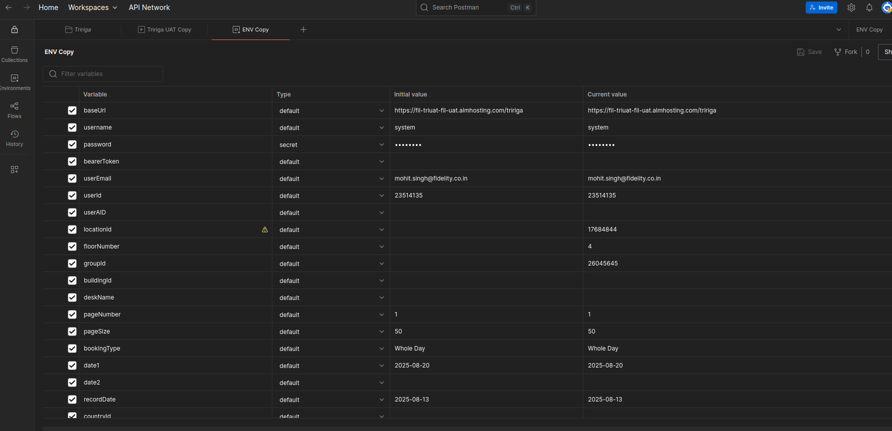
  <figcaption><strong>Graph:</strong> Environment Variables in Postman</figcaption>
</figure>

### 2. Import Postman Collection

**File:** `DeskBooking.postman_collection.json`

- Contains all API requests in correct order.

<figure>
  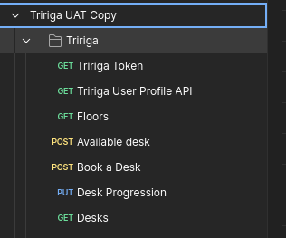
  <figcaption><strong>Graph:</strong> Postman Collection overview</figcaption>
</figure>

---

# 🔑 1. Authentication

```http
GET /tririga/oslc/login?USERNAME={{username}}&PASSWORD={{password}}
```

**Expected:**
- Response: 200 OK
- Cookie: JSESSIONID (required for all subsequent requests)

<figure>
  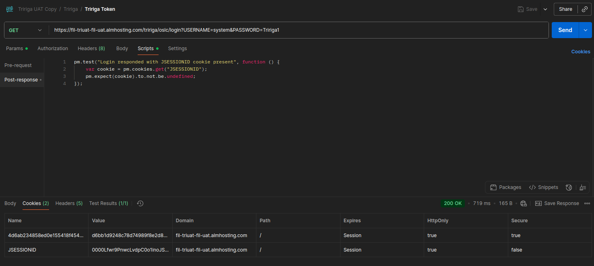
  <figcaption><strong>Graph:</strong> successful Login response showing JSESSIONID</figcaption>
</figure>

---

# 👤 2. User Profile – Retrieval of Groups

```http
GET /tririga/html/en/default/rest/UserProfile?email={{userEmail}}
```

**Purpose:** Validate that the user profile is valid and retrieve the list of groups assigned to the user. This ensures the user is authorized to perform booking operations.

**Headers:**
```
Accept: application/json
Content-Type: application/json
x-api-key: {{xApiKey}}
Cookie: JSESSIONID={{JSESSIONID}}
```

**Body Example (if POST variant is used):**
```json
{
  "email": "JAYANTI.JANU@fidelity.com"
}
```

**Expected:**
- Response: `200 OK`
- Response JSON contains:
  - `userId`
  - `name`
  - `groups[]` array with groupId / groupName values

**Response Example:**
```json
{
  "defaultGroup": null,
  "name": "Jayanti Janu",
  "groups": [
    {
      "groupName": "NBH - 20F - Flex",
      "groupId": 26488302
    },
    {
      "groupName": "NBH - 4CS Desks",
      "groupId": 25674020
    },
    {
      "groupName": "NBH - Advisor Sales",
      "groupId": 25674570
    }
  ]
}
```

**Postman Test Script:**
```javascript
const j = pm.response.json();

pm.test("Status is 200", () => {
  pm.expect(pm.response.code).to.eql(200);
});

pm.test("User has groups assigned", () => {
  pm.expect(j.groups).to.be.an("array").that.is.not.empty;
});

// Capture userId for subsequent booking requests
if (j.userId) {
  pm.environment.set("userId", j.userId);
}
```

<figure>
  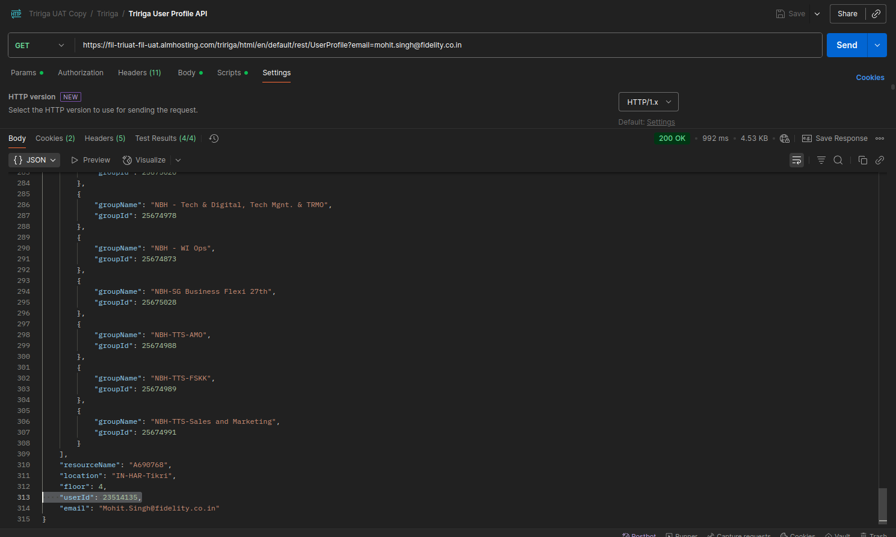
  <figcaption><strong>Graph:</strong> UserProfile response showing groups assigned to user</figcaption>
</figure>

---

# 🏢 3. Floors (Verbose)

```http
POST /tririga/rest/FloorsVerbose
```

**Body:**
```json
{
    "locationId": 17692537,
    "pageNumber": 1,
    "pageSize": 100
}
```

**Captured variables:**
- locationId
- floorNumber
- groupId

**Expected:**
- Response: 200 OK
- At least one floor returned

<figure>
  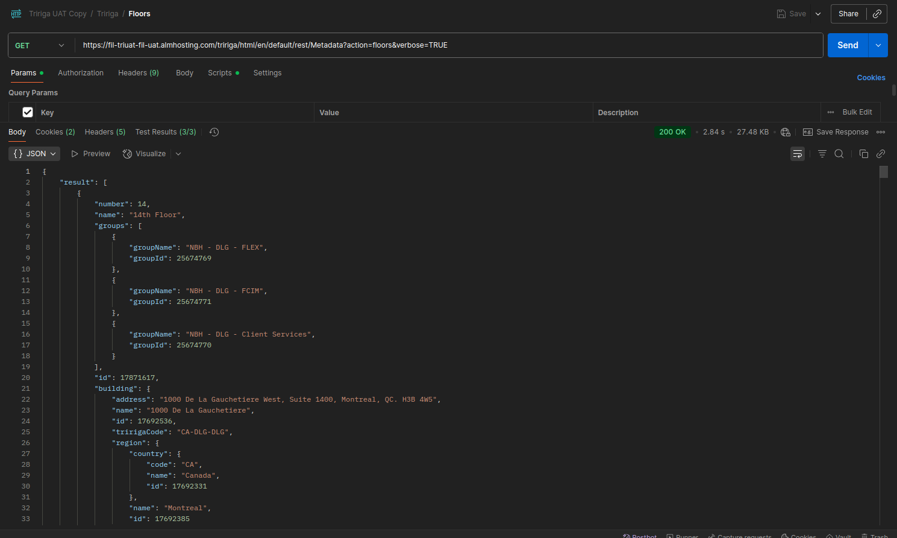
  <figcaption><strong>Graph:</strong> FloorsVerbose response</figcaption>
</figure>

---

# 🔎 3.1 Available Desk – Search & Select

```http
POST /tririga/html/en/default/rest/Metadata?action=availableDesk
```

**Purpose:** Return the list of desks available for a given date/site/floor (optionally filtered by group and user).

**Prerequisites:**
- Login done (JSESSIONID cookie)
- From previous steps:
  - `locationId` (building) from **Floors**
  - `floor` (or `floorNumber`) from **Floors**
  - `groupId` from **Floors** (and user must belong to it in **User Profile**)
  - A booking date **within the advance‑booking window** (e.g., 7/14/30 days per tenant)

**Request Body (working example):**
```json
{
  "dateList": [
    { "date": "2025-08-28", "bookingType": 1 }
  ],
  "locationId": 17692536,
  "floor": 14,
  "groupId": 25674769,
  "userId": "A778250",
  "pageNumber": 1,
  "pageSize": 10
}
```

**Note:** Some tenants accept `floorNumber` instead of `floor`.

**Expected:**
- Response: `200 OK`
- JSON with `availableDesk` array (and pagination fields)

**Response Example (truncated):**
```json
{
  "totalRecords": 2,
  "pageNumber": 1,
  "pageSize": 10,
  "availableDesk": [
    {
      "locationName": "1000 De La Gauchetiere",
      "deskName": "14-11A",
      "locationId": 17692536,
      "groupId": 25674769,
      "deskAttributes": ["Laptop"],
      "floorNumber": 14,
      "floorName": "14th Floor",
      "deskId": 17871703
    },
    {
      "locationName": "1000 De La Gauchetiere",
      "deskName": "14-12A",
      "locationId": 17692536,
      "groupId": 25674769,
      "deskAttributes": [],
      "floorNumber": 14,
      "floorName": "14th Floor",
      "deskId": 17692352
    }
  ]
}
```

**Common Error Scenarios:**
- **TRG-002**: Policy error - move the date closer (inside the site's "advance booking" window)
- **TRG-006/007**: Align `groupId` with the chosen `floor/location` and ensure the user is a member of that group

**Captured Variables:**
- `deskId` → used for booking requests
- `deskName` → for reference and validation

<figure>
  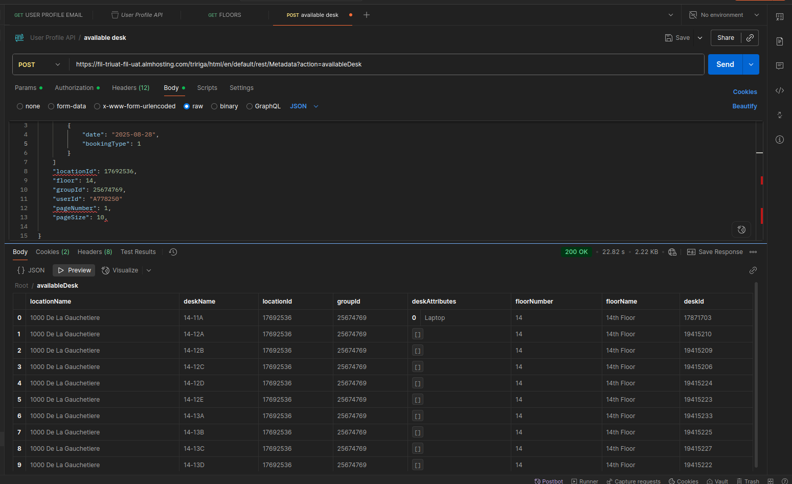
  <figcaption><strong>Graph:</strong> Available Desks</figcaption>
</figure>

---

# 🪑 4. Book a Desk – Single Date

```http
POST /tririga/rest/CreateBooking
```

**Body Example:**
```json
{
    "userId": "23514135",
    "deskId": "24212236",
    "bookingType": "Whole Day",
    "dateList": ["2025-08-20"]
}
```

**Expected:**
- Response: 200 OK or 201 Created
- Response contains bookingId

**Postman Test:**
```javascript
const j = pm.response.json();
pm.environment.set("bookingId", j.result?.bookingId);
pm.test("BookingId captured", () => pm.expect(pm.environment.get("bookingId")).to.exist);
```

<figure>
  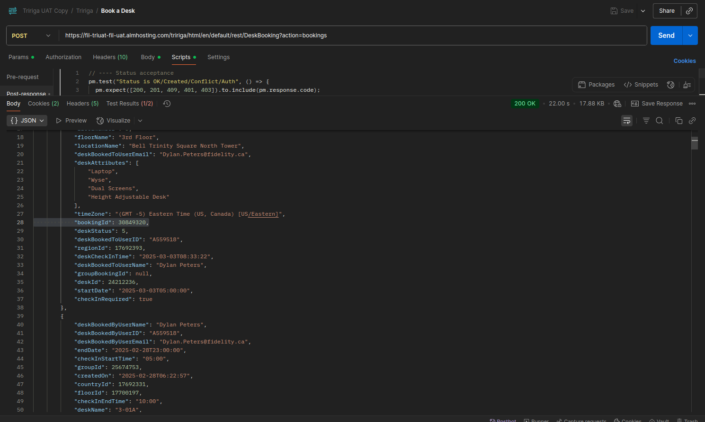
  <figcaption><strong>Graph:</strong> response showing bookingId</figcaption>
</figure>

---

# 🪑 4.1 Book a Desk – Intended User & Multiple Dates

```http
POST /tririga/html/en/default/rest/DeskBooking?action=bookadesk
```

**Body Example:**
```json
{
  "bookingSource": 1,
  "userId": "A675131",
  "deskId": 1769618,
  "intendedUserDetails": { "userId": "A675131" },
  "dateList": [
    { "date": "2025-08-27", "bookingType": 1 },
    { "date": "2025-08-28", "bookingType": 1 }
  ]
}
```

**Expected:**
- Response: `201 Created`
- Response contains `bookingIds` array (one for each date)

**Response Example:**
```json
{
  "bookingIds": [
    147738335,
    147738348
  ]
}
```

**Notes:**
- `intendedUserDetails` allows booking desks for another user (or explicitly confirming the same user)
- Multiple entries in `dateList` result in multiple bookingIds returned in a single request

<figure>
  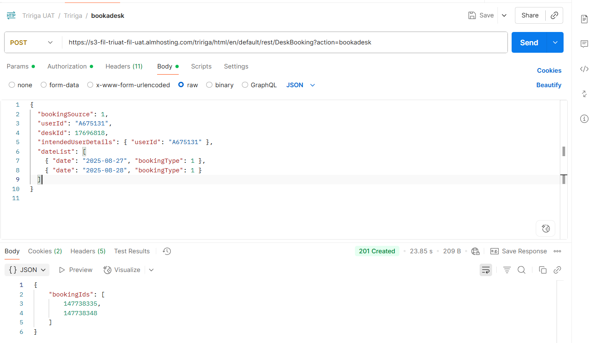
  <figcaption><strong>Graph:</strong> Successful booking response with multiple bookingIds</figcaption>
</figure>

---

# 🔄 5. Desk Progression (Check-In / Check-Out)

```http
PUT /tririga/rest/DeskBooking?action=deskprogression
```

**Body Example:**
```json
{
    "bookingId": 30849320,
    "deskAction": 1,
    "userId": "23514135"
}
```

**deskAction Codes:**
- `1` → Check-out
- `2` → Check-in

**Expected:**
- Response: 200 OK
- Desk status updated (deskStatus in response)

---

# 🔄 5.1 Desk Progression — Cancel / Release a Future Booking

```http
PUT /tririga/html/en/default/rest/DeskBooking?action=deskprogression
```

**Purpose:** Progress an existing desk reservation: **cancel / release** (future), or **check‑in / check‑out** (day‑of), depending on the `deskAction` sent.

**📤 Request (Cancel a future booking):**

**Headers:**
```
Accept: application/json
Content-Type: application/json
Cookie: JSESSIONID={{JSESSIONID}}
```

**Body:**
```json
{
  "bookingId": 26042383,
  "deskAction": 2,
  "userId": "A778034"
}
```

**deskAction codes (commonly used):**
- `1` → Check‑out / Release (contextual)
- `2` → **Cancel** future booking
- (Your tenant may use the same action id for "release" depending on date/time rules; keep value `2` for cancel as shown above.)

**✅ Expected:**
- **HTTP 200 OK**
- Response body is JSON (some tenants return a plain `1` indicating success)
- The **booking is removed** from the user's Calendar (My Reservations → My Calendar)

**Screenshots:**
- API request & 200 response:
<figure>
  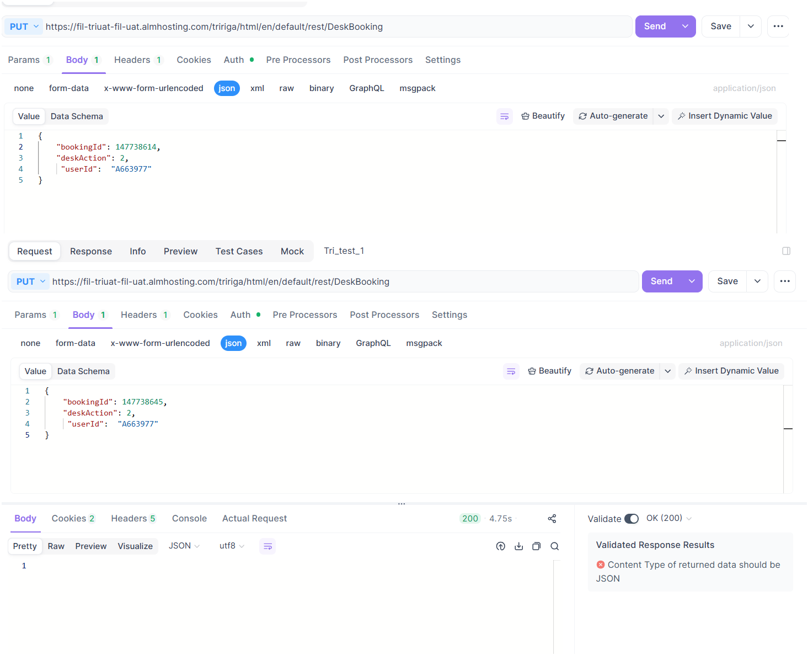
  <figcaption><strong>Graph:</strong> API request and 200 response for canceling future booking</figcaption>
</figure>


- Calendar **before** cancel: 
<figure>
  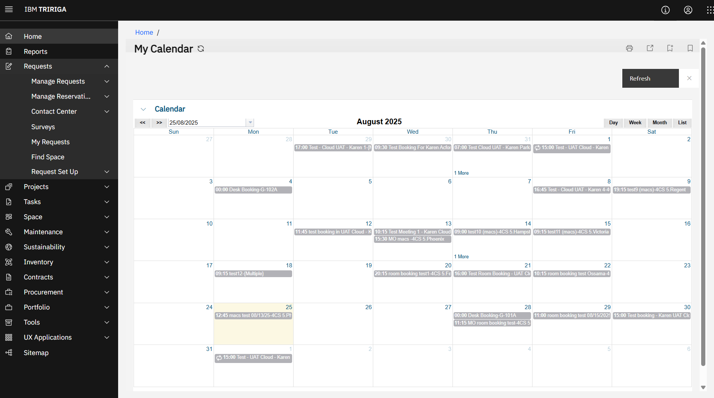
  <figcaption><strong>Graph:</strong> Calendar view before canceling booking</figcaption>
</figure>


- Calendar **after** cancel (booking removed): `./screenshots/deskProgressionCalendarview2.png`
<figure>
  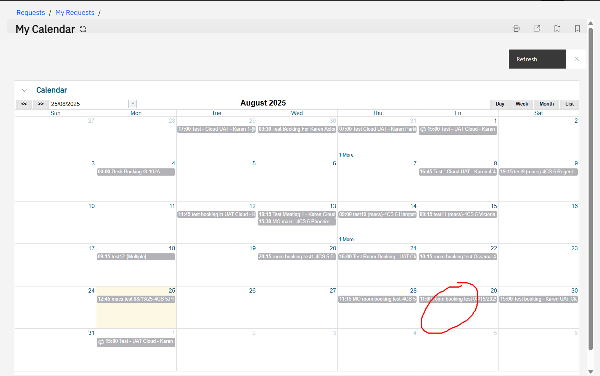
  <figcaption><strong>Graph:</strong> Calendar view after booking cancellation (booking removed)</figcaption>
</figure>

---

# 📅 6. UI Validation – Calendar Verification

**End-to-End Validation:**
Bookings are visible in the **TRIRIGA Calendar** under *Manage Reservations → My Calendar*

**Example Booking Confirmation:**
- 25th August 2025 → `Book a Desk-04-50C`
- 26th–28th August 2025 → `Book a Desk-04-39A`

<figure>
  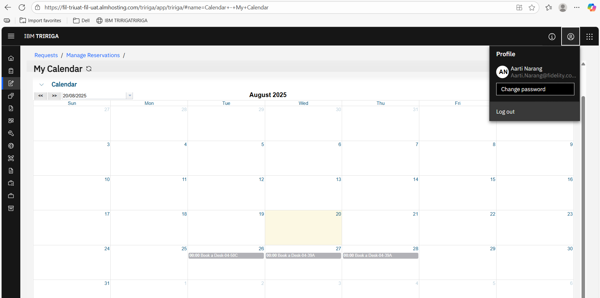
  <figcaption><strong>Graph:</strong> Calendar view confirming successful desk bookings</figcaption>
</figure>

**Validation Points:**
- ✅ API response created booking IDs
- ✅ Calendar UI shows corresponding reservations
- ✅ Date mapping accuracy confirmed
- ✅ End-to-end success of Book a Desk testing validated

---

# ⚠️ 7. Negative & Edge Case Scenarios

These scenarios ensure the Desk Booking API correctly handles invalid inputs and business rules.

## 👤 7.1 Book Desk for Another User (Intended User)

```http
POST /tririga/rest/CreateBooking
```

**Body Example:**
```json
{
    "userId": "23514135",
    "deskId": "24212236",
    "bookingType": "Whole Day",
    "dateList": ["2025-08-20"],
    "intendedUserDetails": {
        "userId": "A778250"
    }
}
```

**Expected:**
- Response: 200 OK or 201 Created
- Response contains `bookingId` for intended user

---

## 🔁 7.2 Book a Desk — Desk Already Booked (Same Day)

```http
POST /tririga/html/en/default/rest/DeskBooking?action=bookadesk
```

**Purpose:** Validate the system shows an attention/error message when attempting to book a desk that is **already reserved on the same date**.

**Headers:**
```
Accept: application/json
Content-Type: application/json
x-api-key: {{xApiKey}}
Cookie: JSESSIONID={{JSESSIONID}}
```

**Body Example:**
```json
{
  "bookingSource": 1,
  "userId": "{{userId}}",
  "deskId": {{deskId}},                // desk already reserved on the target date
  "intendedUserDetails": { "userId": "{{userId}}" },
  "dateList": [
    { "date": "2025-08-26", "bookingType": 1 },
    { "date": "2025-08-27", "bookingType": 1 }
  ]
}
```

**Expected:**
- HTTP status: **409 Conflict** (or **400** on some tenants)
- Error JSON with conflict message
- No booking is created for the conflicting date(s)

**Response Example:**
```json
{
  "errorMessage": "Desk is already booked.",
  "errorCode": "TRG-004"
}
```
<figure>
  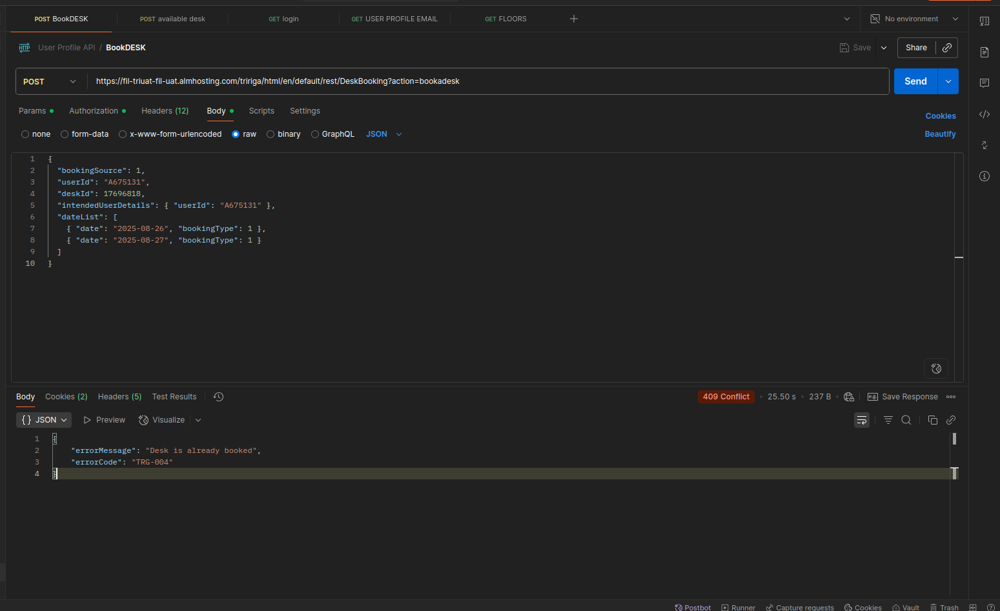
  <figcaption><strong>Graph:</strong>Already Booked</figcaption>
</figure>

---

## ⏳ 7.3 Book a Desk — Past Date Not Allowed

```http
POST /tririga/html/en/default/rest/DeskBooking?action=bookadesk
```

**Purpose:** Validate that the system rejects reservations when the requested date is in the **past**.

**Headers:**
```
Accept: application/json
Content-Type: application/json
x-api-key: {{xApiKey}}
Cookie: JSESSIONID={{JSESSIONID}}
```

**Body Example (past date):**
```json
{
  "bookingSource": 1,
  "userId": "{{userId}}",
  "deskId": {{deskId}},
  "intendedUserDetails": { "userId": "{{userId}}" },
  "dateList": [
    { "date": "2024-08-20", "bookingType": 1 }
  ]
}
```

**Expected:**
- Response: `400 Bad Request`
- Error JSON includes message **"Requested date is in past"** (wording may vary slightly)
- No booking is created

**Response Example:**
```json
{
  "errorMessage": "Requested date is in past",
  "errorCode": "TRG-XXX"
}
```

<figure>
  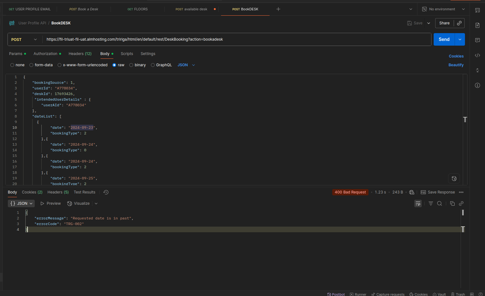
  <figcaption><strong>Graph:</strong>Past Day Booking</figcaption>
</figure>

---

## ⏳ 7.3 Book a Desk — Invalid User

```http
POST /tririga/html/en/default/rest/DeskBooking?action=bookadesk
```

**Purpose:** Validate that the system rejects reservations when using ""invalid"" user ID.

**Headers:**
```
Accept: application/json
Content-Type: application/json
x-api-key: {{xApiKey}}
Cookie: JSESSIONID={{JSESSIONID}}
```

**Body Example (Invalid User):**
```json
{
  "bookingSource": 1,
  "userId": 1234,
  "deskId": {{deskId}},
  "intendedUserDetails": { "userId": "{{userId}}" },
  "dateList": [
    { "date": "2024-08-20", "bookingType": 1 }
  ]
}
```

**Expected:**
- Response: `400 Bad Request`
- Error JSON includes message **errorMessage": "User not found in the system"**
- No booking is created

<figure>
  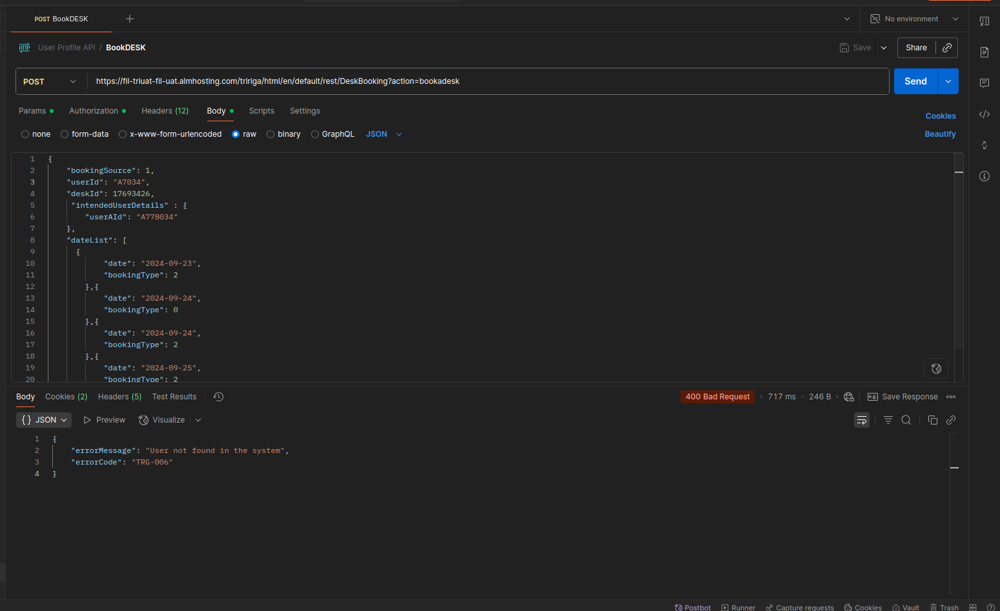
  <figcaption><strong>Graph:</strong>Invalid User</figcaption>
</figure>

---

## 📆 7.4 Weekend Booking

```http
POST /tririga/rest/CreateBooking
```

**Body Example:**
```json
{
    "userId": "23514135",
    "deskId": "24212236",
    "bookingType": "Whole Day",
    "dateList": ["2025-08-23"]
}
```

**Expected:**
- Response: `400 Bad Request`
- Error message: `"Weekend booking not allowed"`

---

## ❌ 7.5 Invalid DeskId

```http
POST /tririga/rest/CreateBooking
```

**Body Example:**
```json
{
    "userId": "23514135",
    "deskId": "99999999",
    "bookingType": "Whole Day",
    "dateList": ["2025-08-20"]
}
```

**Expected:**
- Response: `400 Bad Request`
- Error code: `"TRG-XXX"` (Invalid deskId)

---

## ⛔ 7.4 Desk Progression — Check‑out Not Allowed Without Check‑in (Future Date)

```http
PUT /tririga/html/en/default/rest/DeskBooking?action=deskprogression
```

**Purpose:** Validate that a user **cannot check‑out** a reservation **before** having **checked‑in**, and that **future‑dated** bookings cannot be progressed to check‑out.

**📤 Request (attempt check‑out on a future booking without check‑in):**

**Headers:**
```
Accept: application/json
Content-Type: application/json
Cookie: JSESSIONID={{JSESSIONID}}
```

**Body:**
```json
{
  "bookingId": {{bookingId}},   // future-dated booking
  "deskAction": 1,              // check-out/release action
  "userId": "{{userId}}"
}
```

**✅ Expected:**
- HTTP status: **400 Bad Request**
- Error JSON with message indicating **check‑in is required / only current‑day check‑in allowed** (examples)

```json
{
  "errorMessage": "Bookable Desk Booking needs to be Checked-In first",
  "errorCode": "TRG-009"
}
```

<figure>
  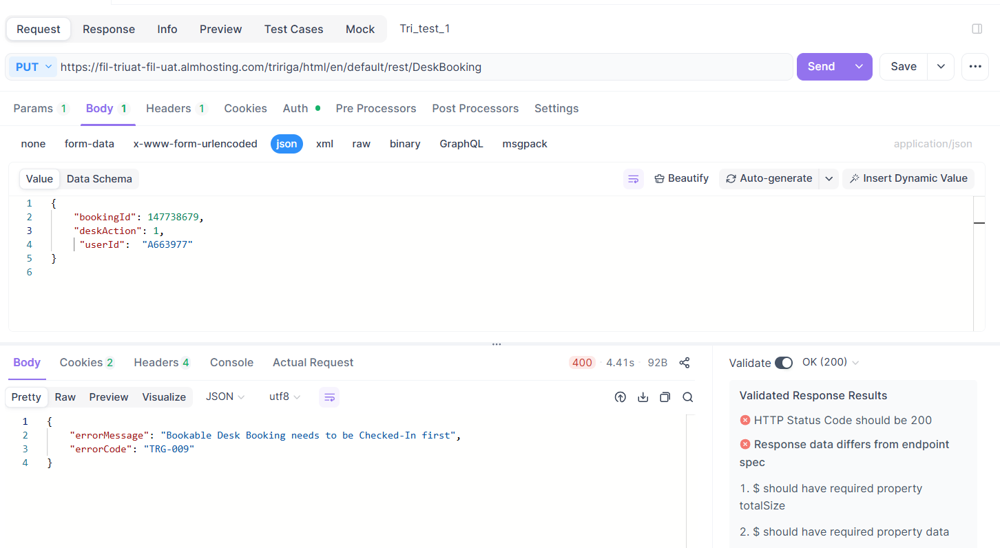
  <figcaption><strong>Graph:</strong>checkoutWithoutcheckIn</figcaption>
</figure>

---

## ⛔ 7.5 Desk Progression — Check‑in Not Allowed for Past/Invalid Booking (No Active Booking)

```http
PUT /tririga/html/en/default/rest/DeskBooking?action=deskprogression
```

**Purpose:** Validate that a user **cannot check‑in** using a **bookingId that is not active** (e.g., a past reservation or an ID that no longer exists). The API must return a clear error.

**📤 Request (attempt check‑in for a previous‑date booking):**

**Headers:**
```
Accept: application/json
Content-Type: application/json
Cookie: JSESSIONID={{JSESSIONID}}
```

**Body:**
```json
{
  "bookingId": 26042167,       // reservation from a previous date / not active
  "deskAction": 0,             // 0 = Check‑in (tenant-specific)
  "userId": "A778034"
}
```

**✅ Expected:**
- HTTP status: **400 Bad Request**
- Error JSON:

```json
{
  "errorMessage": "booking does not exist!",
  "errorCode": "TRG-009"
}
```
**Screenshots:**

- Request and 400 response: 
<figure>
  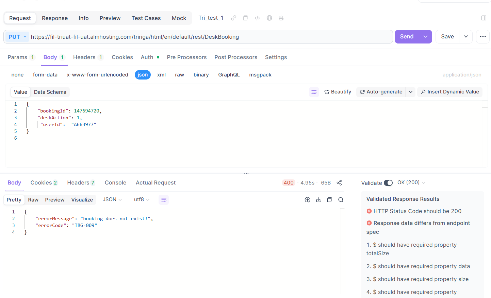
  <figcaption><strong>Graph:</strong> API request and 400 response for invalid booking ID</figcaption>
</figure>


- Reservation detail (shows historic/past booking id): 

<figure>
  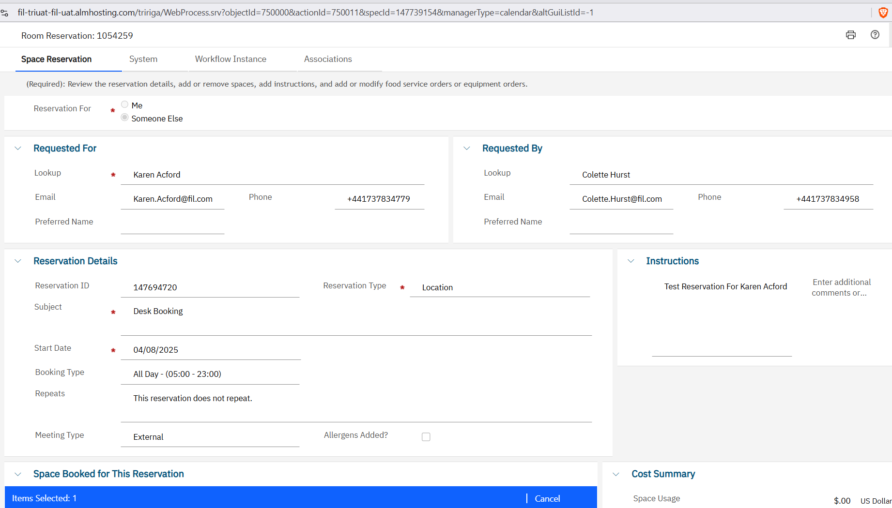
  <figcaption><strong>Graph:</strong> Historical booking ID details</figcaption>
</figure>


- Calendar (no active booking for check‑in):

<figure>
  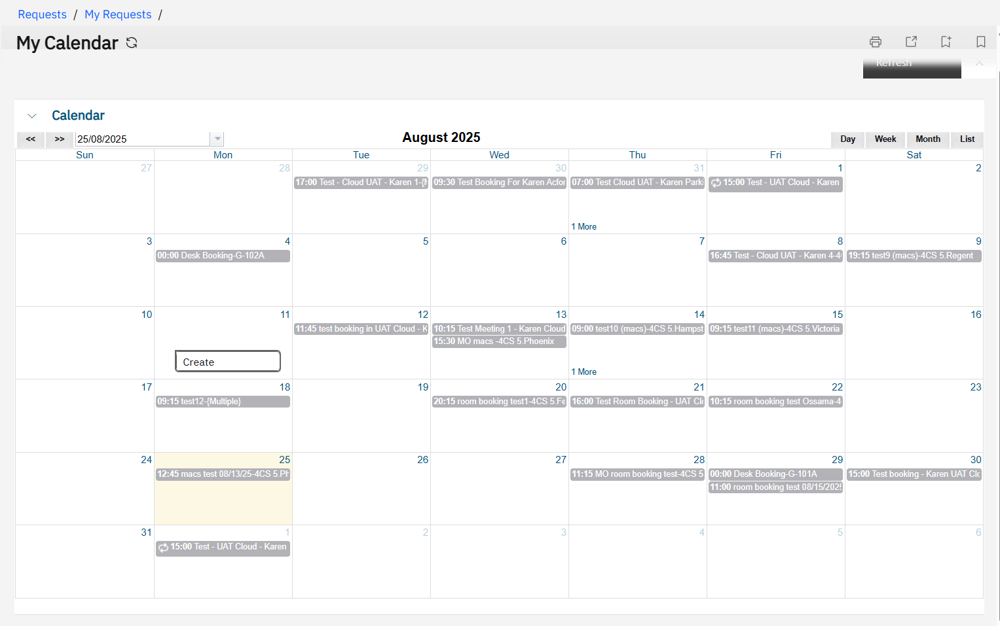
  <figcaption><strong>Graph:</strong> Calendar showing no active booking for check-in</figcaption>
</figure>

---

## ⛔ 7.4 Book a Desk — Advance Booking Window

```http
POST /tririga/html/en/default/rest/DeskBooking?action=bookadesk
```

**Purpose:** Validate that the API enforces the **Advance Booking Period**. When the requested date is **beyond the allowed window**, the request is rejected with a clear policy error.

**Headers:**
```
Accept: application/json
Content-Type: application/json
x-api-key: {{xApiKey}}
Cookie: JSESSIONID={{JSESSIONID}}
```

**📤 Request (date outside the allowed window):**
```json
{
  "bookingSource": 1,
  "userId": "{{userId}}",
  "deskId": {{deskId}},
  "intendedUserDetails": { "userId": "{{userId}}" },
  "dateList": [
    { "date": "2025-09-30", "bookingType": 1 }   // deliberately beyond window
  ]
}
```

**Expected:**
- HTTP status: **400 Bad Request**
- Error JSON:

```json
{
  "errorMessage": "Requested booking date exceeds advance booking period",
  "errorCode": "TRG-002"
}
```

<figure>
  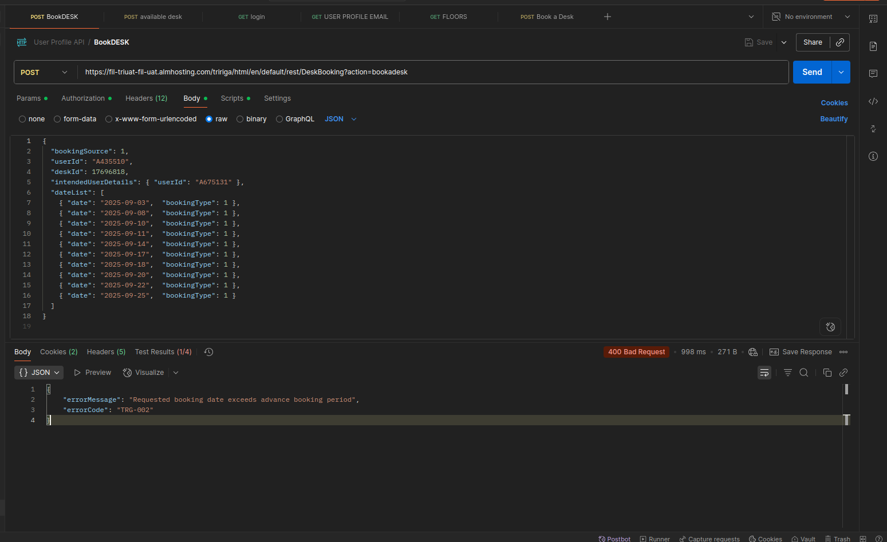
  <figcaption><strong>Graph:</strong>Date Exceeds</figcaption>
</figure>

---

## 📧 7.6 Invalid User Profile (Email)

```http
GET /tririga/rest/UserProfile?email=not_a_valid_email@test.com
```

**Expected:**
- Response: `404 Not Found` or `400 Bad Request`
- Error message: `"Invalid user email"`

<figure>
  
  <figcaption><strong>Graph:</strong> Invalid Email</figcaption>
</figure>

<figure>
  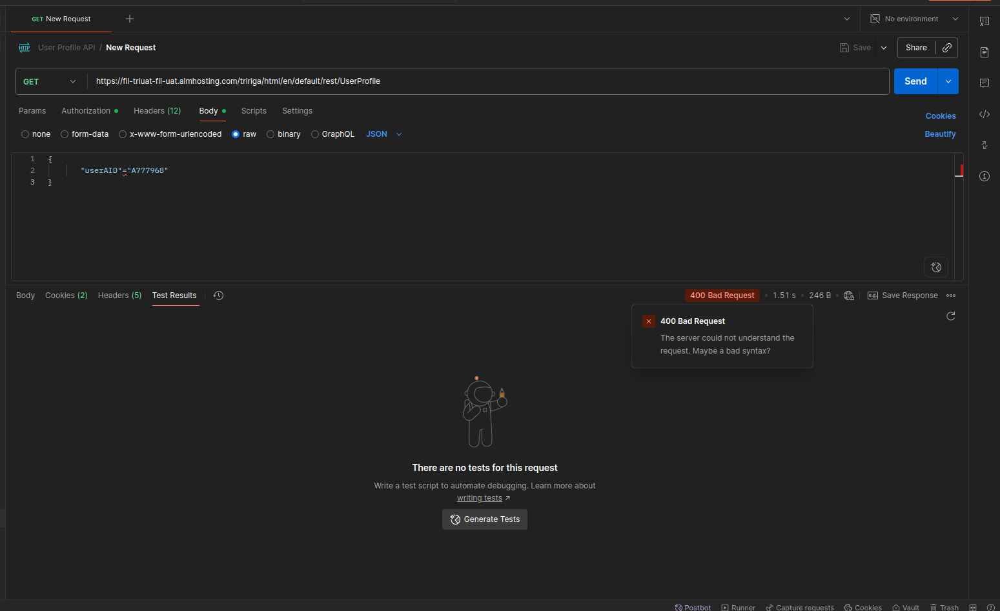
  <figcaption><strong>Graph:</strong> userAID</figcaption>
</figure>

<figure>
  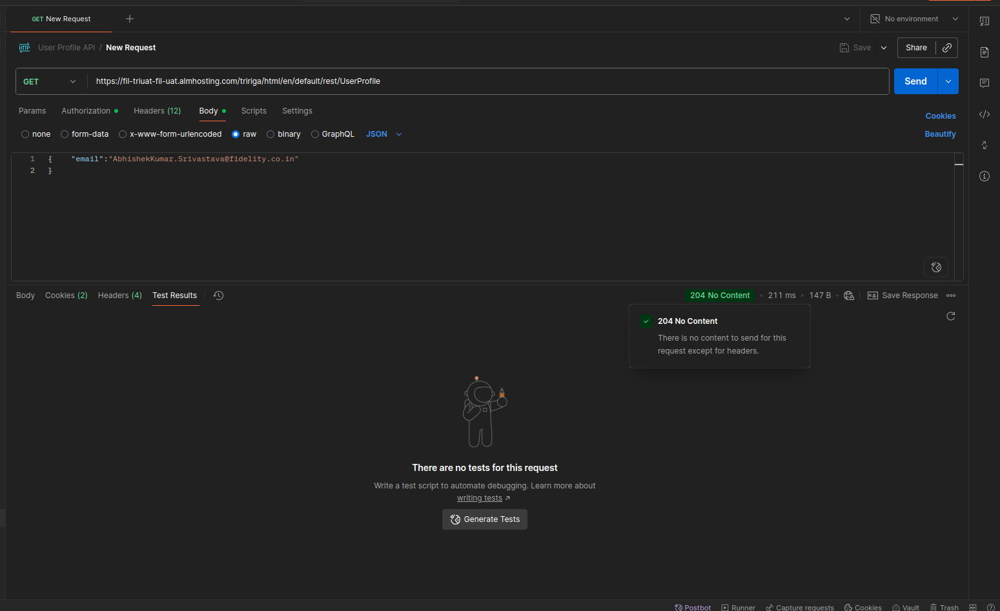
  <figcaption><strong>Graph:</strong>Retired User Email</figcaption>
</figure>

---

## Desk Progression — Check‑in Blocked for Past/Inactive Booking (Booking Does Not Exist)
```http
PUT /tririga/html/en/default/rest/DeskBooking?action=deskprogression
```

**Purpose:** Ensure a user cannot check‑in using a bookingId that is not active anymore (e.g., a past reservation, cancelled, or invalid ID). The API must reject the request with a clear error.

**📤 Request**

**Headers:**
```
Accept: application/json
Content-Type: application/json
Cookie: JSESSIONID={{JSESSIONID}}
```

**Body**
```
{
  "bookingId": 26042167,     // past/invalid booking id
  "deskAction": 0,           // 0 = Check-in (tenant specific)
  "userId": "A778034"
}
```

**✅ Expected**

- HTTP status: 400 Bad Request
- Error JSON:
```
{
  "errorMessage": "Booking does not exist!",
  "errorCode": "TRG-009"
}

```

<figure>
  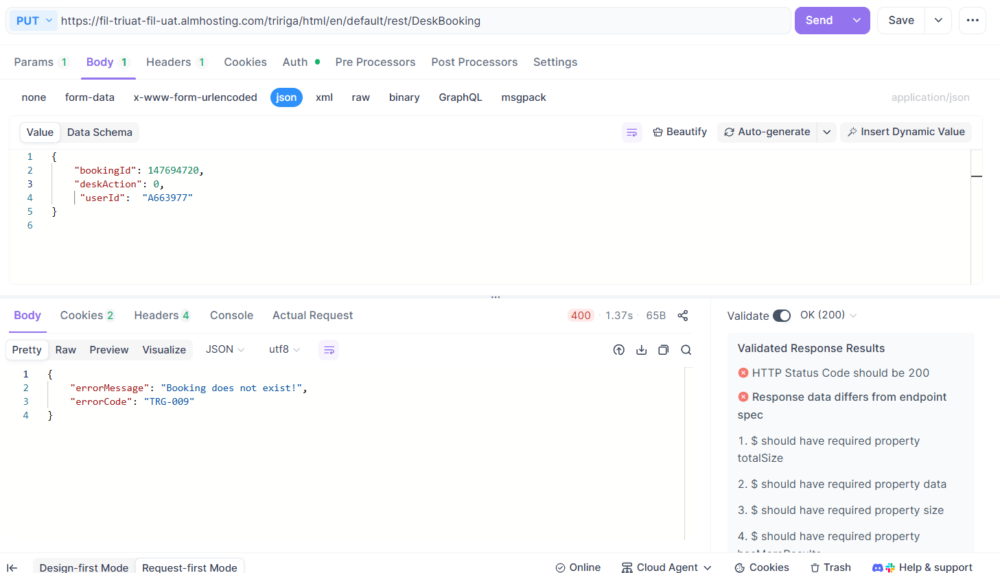
  <figcaption><strong>Graph:</strong> Desk Progression Previous Date Booking Error message</figcaption>
</figure>
---

## 🚫 7.11 Desk Progression — Organizer Cannot Check‑in for Someone Else (Unauthorized)

```http
PUT /tririga/html/en/default/rest/DeskBooking?action=deskprogression
```

**Purpose:** Ensure the API blocks **check‑in** when the caller is **not the booking owner** (i.e., organizer tries to check‑in a desk **booked for another user**).

**📤 Request:**

**Headers:**
```
Accept: application/json
Content-Type: application/json
Cookie: JSESSIONID={{JSESSIONID}}
```

**Body:**
```json
{
  "bookingId": 26374400,     // booking created for a different user
  "deskAction": 0,           // 0 = Check-in (tenant specific)
  "userId": "A778034"        // organizer / not the booking owner
}
```

**✅ Expected:**
- HTTP status: **400 Bad Request**
- Error JSON indicates lack of permission, typically:

```json
{
  "errorMessage": "User not authorized",
  "errorCode": "TRG-007"
}
```

<figure>
  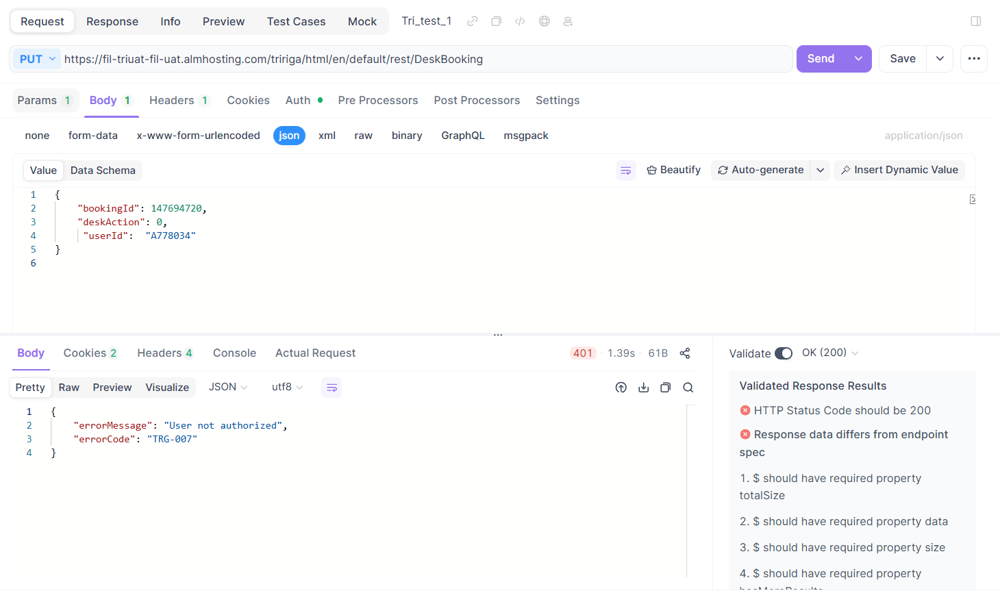
  <figcaption><strong>Graph:</strong> User Not Authorized error response</figcaption>
</figure>

---

## Desk Progression — Cancel Not Allowed for Past/Inactive Booking (Booking Does Not Exist)
```http
PUT /tririga/html/en/default/rest/DeskBooking?action=deskprogression
```

**Purpose:** Confirm the API rejects a cancel/release operation when the bookingId is not active (e.g., past reservation or invalid/cancelled id). The service must return a clear policy error.

**📤 Request**

**Headers**
```
Accept: application/json
Content-Type: application/json
Cookie: JSESSIONID={{JSESSIONID}}
```

**Body**
```
{
  "bookingId": 26042167,   // past/invalid booking id
  "deskAction": 2,         // 2 = Cancel (tenant-specific)
  "userId": "A778034"
}
```
**✅ Expected**

- HTTP status: 400 Bad Request
- Error JSON:
```
{
  "errorMessage": "Booking does not exist!",
  "errorCode": "TRG-009"
}
```

<figure>
  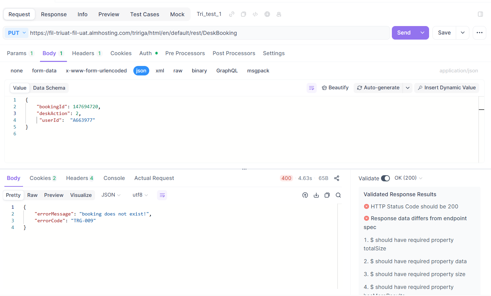
  <figcaption><strong>Graph:</strong> Desk Progression Cancel Previous Date Booking Error message</figcaption>
</figure>

---

## 🚫 7.11 Desk Progression — Organizer Cannot Check‑out for Someone Else (Unauthorized)

```http
PUT /tririga/html/en/default/rest/DeskBooking?action=deskprogression
```

**Purpose:** Ensure the API blocks **check‑out** when the caller is **not the booking owner** (i.e., organizer tries to check‑out a desk **booked for another user**).

**📤 Request:**

**Headers:**
```
Accept: application/json
Content-Type: application/json
Cookie: JSESSIONID={{JSESSIONID}}
```

**Body:**
```json
{
  "bookingId": 147694720,     // booking created for a different user
  "deskAction": 1,           // 1 = Check-out (tenant specific)
  "userId": "A778034"        // organizer / not the booking owner
}
```

**✅ Expected:**
- HTTP status: **400 Bad Request**
- Error JSON indicates lack of permission, typically:

```json
{
  "errorMessage": "User not authorized",
  "errorCode": "TRG-007"
}
```

<figure>
  
  <figcaption><strong>Graph:</strong> Check Out - User Not Authorized error response</figcaption>
</figure>

---

## 🚫 7.11 Desk Progression — User Cannot Cancel after check in time is passout (Bumped status)

```http
PUT /tririga/html/en/default/rest/DeskBooking?action=deskprogression
```

**Purpose:** Ensure the API blocks **Cancel** when the check in time is passout **(Bumped status)**

**📤 Request:**

**Headers:**
```
Accept: application/json
Content-Type: application/json
Cookie: JSESSIONID={{JSESSIONID}}
```

**Body:**
```json
{
  "bookingId": 147694720,     // booking created for a different user
  "deskAction": 2,           // 1 = Check-out (tenant specific)
  "userId": "A663977"        // organizer
}
```

**✅ Expected:**
- HTTP status: **400 Bad Request**
- Error JSON indicates lack of permission, typically:

```json
{
  "errorMessage": "User not authorized",
  "errorCode": "TRG-007"
}
```

<figure>
  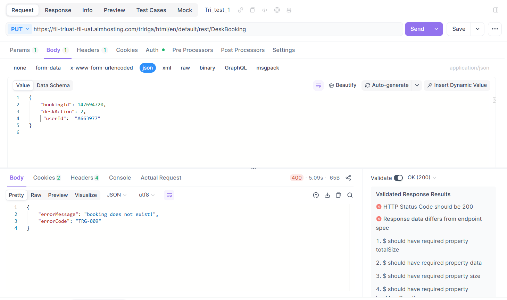
  <figcaption><strong>Graph:</strong> Cancel Passout Bumped status - error response</figcaption>
</figure>

---


# 📊 8. Validation Queries (Follow-up)

## 8.1 Verify Booking Exists

```http
GET /tririga/rest/GetBookings?userId={{userId}}&recordDate={{date1}}&pageNumber=1&pageSize=50
```

**Expected:**
- Response: 200 OK
- `bookingId` present in returned list
- DeskId matches previously booked desk

---

# 🎯 Testing Completion Criteria

**Functional Validation:**
- ✅ Single date booking functionality
- ✅ Multiple date booking capability
- ✅ Intended user booking permissions
- ✅ API response validation (booking IDs generation)
- ✅ UI integration confirmation through calendar display

**Error Handling Validation:**
- ✅ Duplicate booking prevention
- ✅ Past date validation
- ✅ Weekend booking restrictions
- ✅ Invalid data handling (deskId, userId)

**End-to-End Integration:**
- ✅ API-to-Database persistence
- ✅ Database-to-UI synchronization
- ✅ Real-time calendar updates
