# Fidelity TAS 5.0 Upgrade – Unit Test Results

**Prepared by:** Souleiman Bentouyer  
<!-- {docsify-updated} -->
**Environment:** TRIRIGA Application Suite 5.0 – DEV  

---

## 📘 Objective

This document tracks the execution and status of unit tests defined as part of the TAS 5.0 migration validation. The tests focus on ensuring functional correctness and business logic continuity across reservation-related objects after the migration.

---

### ✅ UT001 – Validate Table Structure: `T_TRI_RESERVATION`

**Area:** <span style="color:green; font-weight:bold;">Reservation Management</span>

**Purpose:**  
Ensure that the `triReservation` Business Object (BO) is properly deployed and that its corresponding database table `T_TRI_RESERVATION` has been correctly generated following the TAS 5.0 migration.

**Status:** ✅ PASSED

**Validation Steps:**

- Verified the presence of `triReservation` in **Form Builder** with status **Published**
- Confirmed the existence of essential fields:
  - `triNameTX`
  - `triStartDT`
  - `triEndDT`
  - `triRequestedbyEmailTX`
- Successfully accessed the **Preview** screen, indicating:
  - Functional BO-to-table mapping
  - Table `T_TRI_RESERVATION` is active and accessible

<figure>
  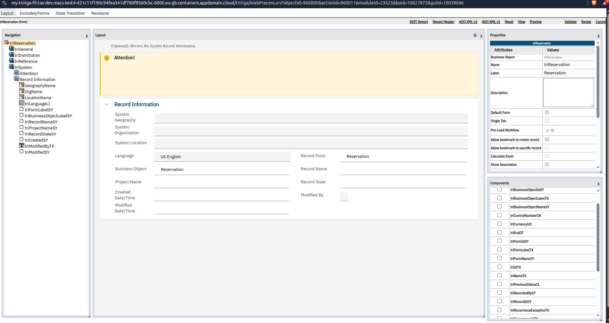
  <figcaption><strong>Screenshot:</strong> triReservation found in Form Builder</figcaption>
</figure>

<figure>
  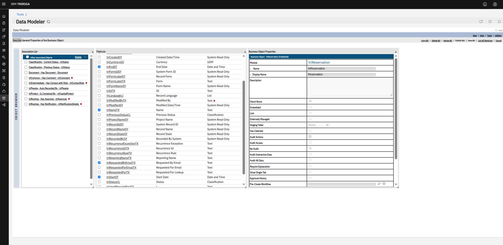
  <figcaption><strong>Screenshot:</strong> triReservation found in Form Builder</figcaption>
</figure>

---

### ✅ UT002 – Convert Legacy Data to TRIRIGA Format

**Area:** <span style="color:green; font-weight:bold;">Reservation Management</span>

**Purpose:**  
Ensure that legacy-formatted reservation records can be ingested into the `triReservation` object using TRIRIGA’s **Data Integrator** and that the resulting records are structurally and functionally valid.

**Status:** ✅ PASSED

**Execution Summary:**

- Used **Data Integrator** to upload a `.txt` file with headers:
  - `triReservationNameTX`, `triStartDate`, `triEndDate`, `triRequestedByEmailTX`, `triCurrencyUO`, `triStatusCL`, `triIdTX`

<figure>
  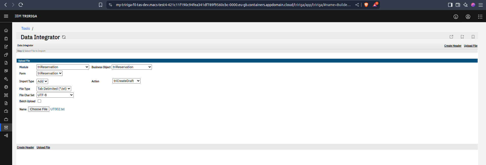
  <figcaption><strong>Screenshot:</strong> Upload Monitor</figcaption>
</figure>

Upload completed successfully with **status: Rollup All Completed**

✅ The upload workflow validated the ability to transform and persist legacy-format data into TRIRIGA, ensuring business continuity for reservation data post-migration.

<figure>
  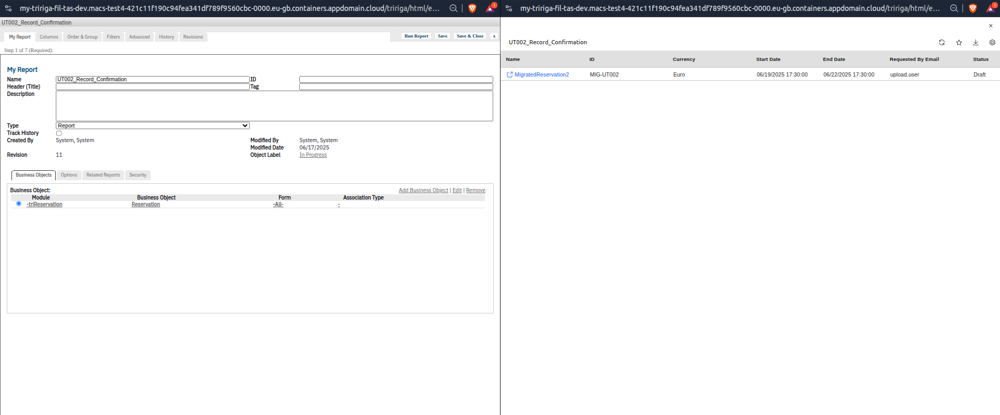
  <figcaption><strong>Screenshot:</strong> Uploaded record in report</figcaption>
</figure>

**📋 Validation Checklist**

| Validation Steps                              | Outcome |
|-----------------------------------------------|---------|
| Record was created in `triReservation` BO     | ✅       |
| Required fields were correctly populated      | ✅       |
| Date fields interpreted correctly and stored  | ✅       |
| Record status correctly set (e.g., Draft)     | ✅       |
| Record is visible via Report Manager          | ✅       |
| No errors in Data Upload Errors tab           | ✅       |

---

### ✅ UT003 – Validate Required Field Enforcement

**Area:** <span style="color:green; font-weight:bold;">Reservation Management</span>

**Purpose:**  
Ensure that all **mandatory fields** defined on the `triReservation` BO are enforced during record creation via automated ingestion (Data Integrator).

**Why It Matters:**  
Validates that data integrity rules are working. Records missing key fields should not be created, preserving workflow and reporting quality.

**Status:** ✅ PASSED

**Validation Flow:**

- Uploaded test file `triReservation_testupload.txt` with:
  - `triReservationNameTX`, `triStartDate`, `triEndDate`, `triRequestedbyTX`, `triCurrencyUO`, `triStatusCL`, `triIdTX`
- Navigated to: `Tools > System Setup > System > Data Upload`

<figure>
  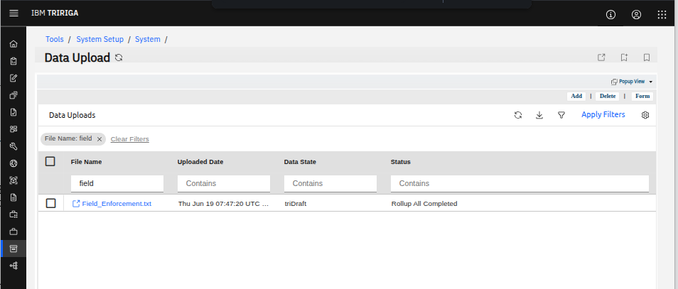
  <figcaption><strong>Screenshot:</strong> Upload Monitor shows success</figcaption>
</figure>

- Observed:
  - ✅ File processed successfully
  - ✅ Rollup All Completed

<figure>
  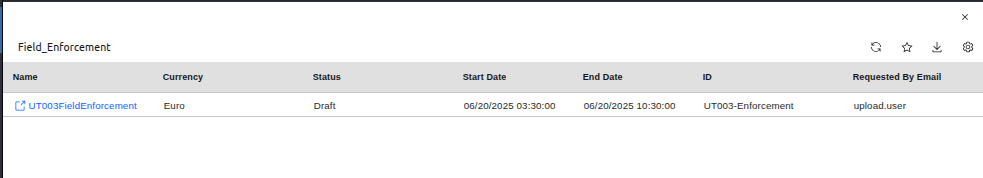
  <figcaption><strong>Screenshot:</strong> Report Manager</figcaption>
</figure>

- Checked `Tools > Report Manager`:
  - ✅ Records appear with required fields populated
  - ✅ Status = `Draft`
  - ✅ No errors thrown

---

### ✅ UT004 – Validate Form Behavior in UI

**Area:** <span style="color:green; font-weight:bold;">Reservation Management</span>

**Purpose:**  
Ensure that creating a reservation through the **TRIRIGA UI form** auto-populates system fields like `triCreatedSY`, `triStatusCL`, and `triCreatedDateDT`.

**Why It Matters:**  
Out-of-the-box system field behavior is critical to maintain audit integrity and workflow routing.

**Status:** ✅ PASSED

**Validation Steps:**

- Navigated to: `Requests > My Requests > Request for Reservation`

<figure>
  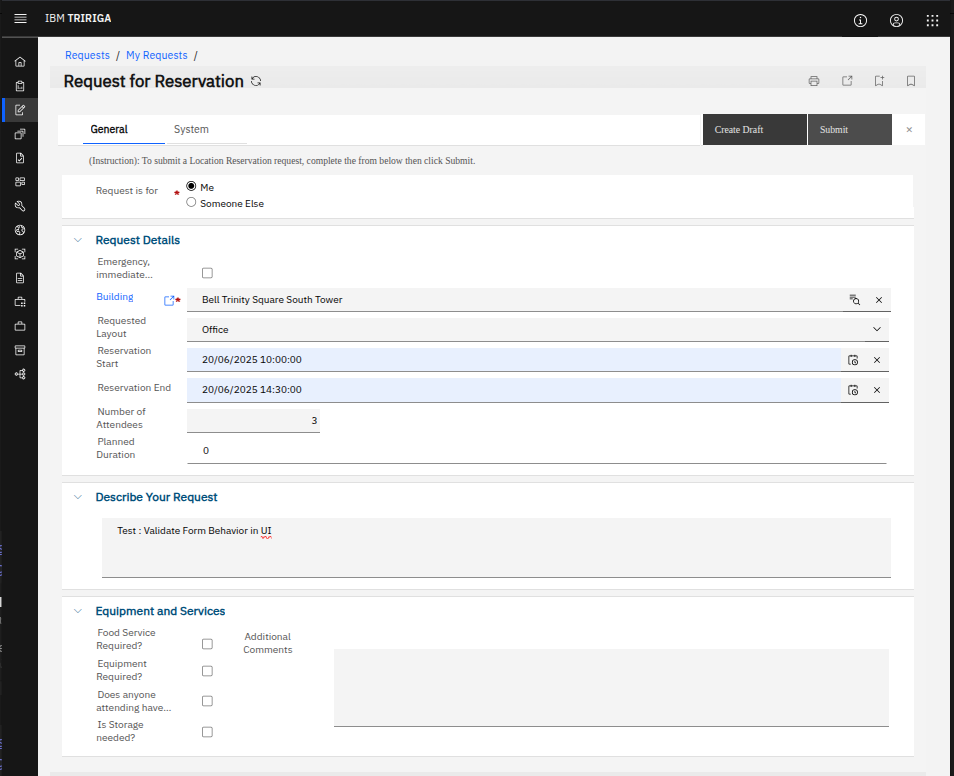
  <figcaption><strong>Screenshot:</strong> Filling Request</figcaption>
</figure>

- Submitted new reservation
- Located it via:
  - `My Request History`
  - Direct preview access

<figure>
  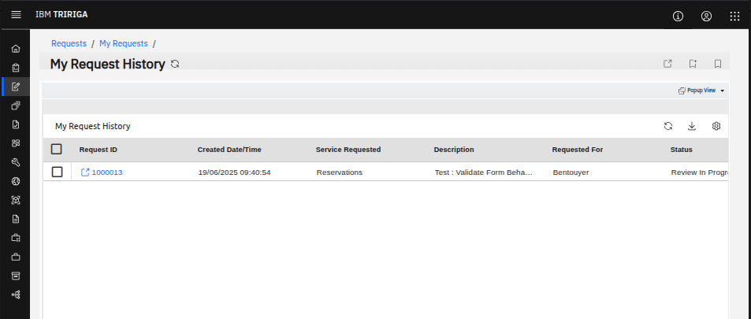
  <figcaption><strong>Screenshot:</strong> Confirmation</figcaption>
</figure>

- Confirmed system fields auto-filled:
  - ✅ `triCreatedSY` = current user
  - ✅ `triCreatedDateDT` = current timestamp
  - ✅ `triStatusCL` = Draft (or equivalent)

---

### ✅ UT005 – Validate Reservation-to-Task Linkage

**Area:** <span style="color:blue; font-weight:bold;">Task & Service Integration</span>

**Purpose:**  
Ensure that reservation records (from the `triReservation` object) can be successfully linked to task records (`triTask`) and that this relationship behaves as expected following the TAS 5.0 migration.

**Status:** ✅ PASSED

**Validation Steps:**

- Created a **Work Task** via TRIRIGA UI  
- Navigated to the **Requests** tab of the task  
- Manually associated **reservation ID `1000013`**  
- Verified:  
  - ✅ Linkage was saved without error  
  - ✅ Reservation request displayed correctly in the task form  
  - ✅ All form fields remained functional and editable

<figure>
  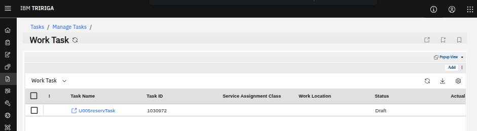
  <figcaption><strong>Screenshot:</strong> Reservation linked in Task</figcaption>
</figure>

<figure>
  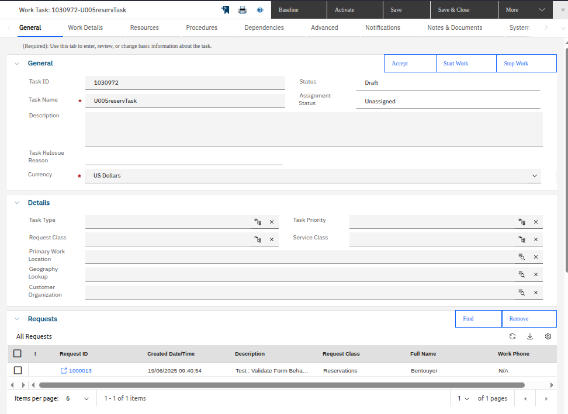
  <figcaption><strong>Screenshot:</strong> Reservation linked in Task</figcaption>
</figure>

---

### ✅ UT006 – Validate Reservation Lifecycle Integrity

**Area:** <span style="color:green; font-weight:bold;">Reservation Management</span>

**Purpose:**  
Verify that a reservation record (`triReservation`) progresses through its intended lifecycle statuses (e.g., `Draft` → `Submitted` → `Review In Progress` → `Issued`) and that each transition triggers expected behavior (e.g., field updates, workflow calls, or lock-downs).

**Why It Matters:**  
Ensures that the **lifecycle engine** and related **workflows** behave as intended post-migration — protecting process integrity and automation logic.

**Status:** ✅ PASSED

**Validation Steps:**

- **Step 1: Create Reservation**
  - Status defaults to **Draft**
  - Fields populated: `triCreatedSY`, `triCreatedDateDT`, `triStatusCL`

- **Step 2: Submit Reservation**
  - Status updated to **Review In Progress**
  - System transitions tracked in the reservation history

- **Step 3: Review Flow**
  - Manually advanced record to **Issued**
  - Observed:
    - ✅ Record locking enabled  
    - ✅ Audit trail updated

<figure>
  
  <figcaption><strong>Screenshot:</strong> Reservation Lifecycle Review</figcaption>
</figure>

<figure>
  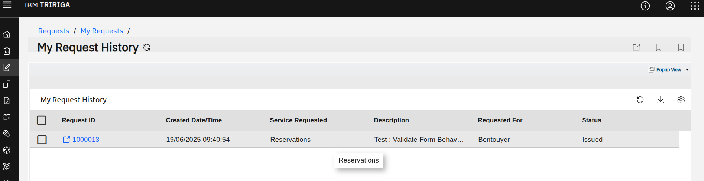
  <figcaption><strong>Screenshot:</strong> Reservation Lifecycle Issued</figcaption>
</figure>

<figure>
  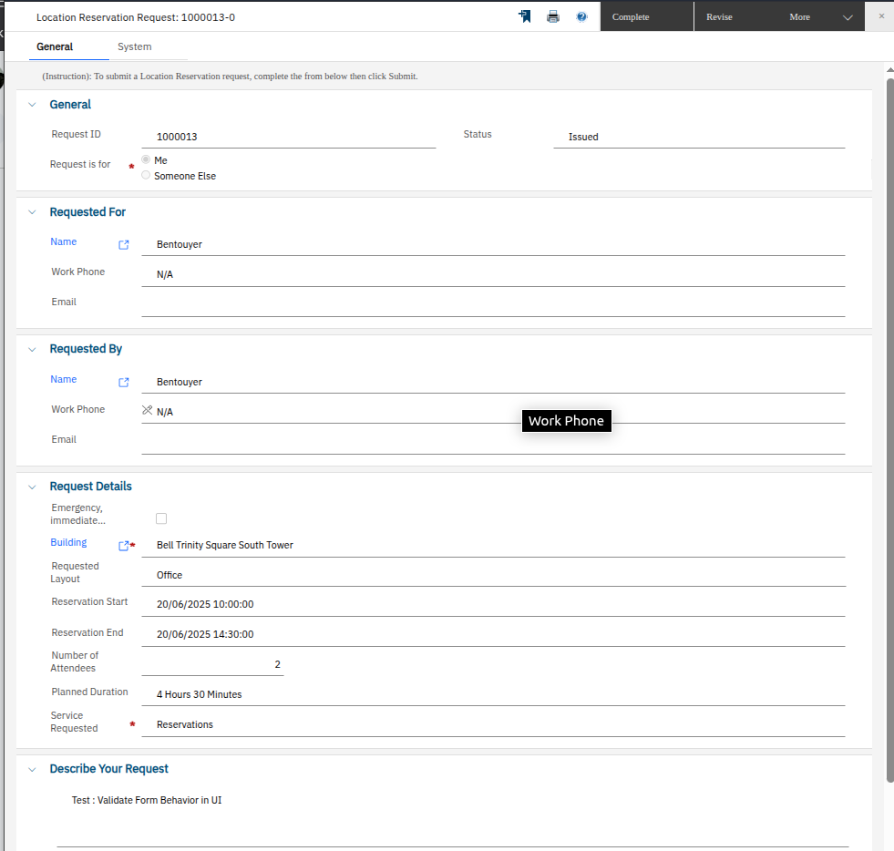
  <figcaption><strong>Screenshot:</strong> Reservation Lifecycle Issued</figcaption>
</figure>

---

### ⚠️ UT007 – Validate Space Availability Enforcement via Reservation

**Area:** <span style="color:green; font-weight:bold;">Reservation Management</span>

**Purpose:**  
Ensure that creating a reservation updates **space availability** — preventing double-booking and reflecting accurate utilization in TRIRIGA calendars or availability views.

**Why It Matters:**  
This test confirms whether reservations impact space planning logic, availability views, and booking enforcement — all critical for space utilization accuracy post-migration.

**Status:** ⚠️ To Fix

**Current Findings:**

- Reserved a vacant space (`02A8084`)
- Navigated to **availability view** and **occupied space calendar**
- ❌ No data appears (neither for active reservations nor conflicts)
- ❌ Calendar does not reflect expected occupancy status

**Screenshots:**

<figure>
  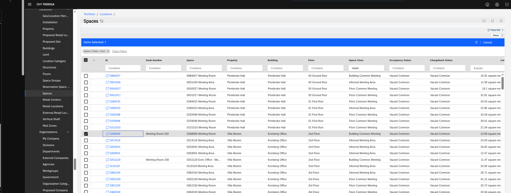
  <figcaption><strong>Screenshot:</strong> Availability – Blank Calendar</figcaption>
</figure>

<figure>
  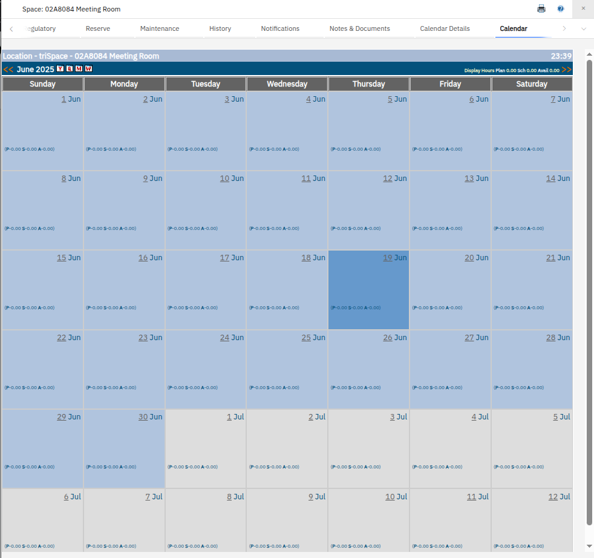
  <figcaption><strong>Screenshot:</strong> Availability – No Occupied Indicator</figcaption>
</figure>

**Next Steps:**

- Investigate:
  - Reservation mapping to **triSpaceReserve**
  - Calendar source object configuration
  - Whether `triReservation` records are properly linked to space inventory
- Check for required triggers or workflows that update availability flags

---

### ✔️ UT008 – Prevent Invalid Date Ranges in Reservation

**Area:** <span style="color:green; font-weight:bold;">Reservation Management</span>

**Purpose:**  
Ensure that reservation `StartDate` is earlier than `EndDate`, and that the system blocks illogical inputs (e.g., end before start), maintaining temporal data integrity.

**Why It Matters:**  
Failing to enforce this breaks:

- Business logic (duration/occupancy)
- Workflow triggers (e.g., calendar sync)
- Downstream reporting or resource allocation

**Status:** ✔️ Known issue – not a blocker

**Validation Summary:**

- Entered:
  - **Start**: `23/06/2025 12:00:00`
  - **End**: `20/06/2025 16:30:00`
- UI allowed submission → status moved to **Review In Progress**
- Calculated duration: `2 Days 19 Hours 30 Minutes` (illogical)
- No warnings or validation errors were raised

**Current Behavior:**

In both post & pre-migration environments, the application allows submission of reservations where the Start Date is after the End Date.

No validation error is triggered, and the record transitions to Review In Progress.

**Test Result:**

✔️ Not a regression – The same behavior is present in the pre-TAS environment, meaning this issue predates the migration and does not block go-live.

**Screenshot:**  

<figure>
  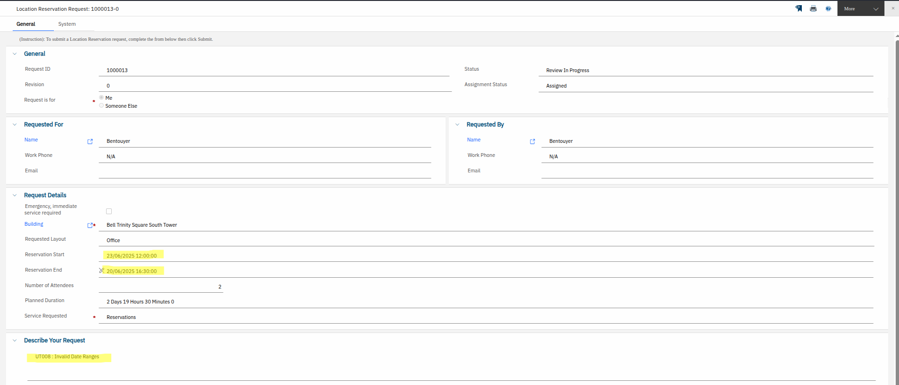
  <figcaption><strong>Screenshot:</strong> Invalid Duration Recorded</figcaption>
</figure>

<figure>
  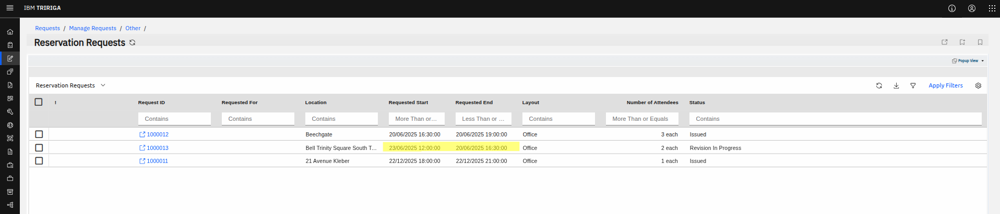
  <figcaption><strong>Screenshot:</strong> Invalid Duration Recorded</figcaption>
</figure>

<figure>
  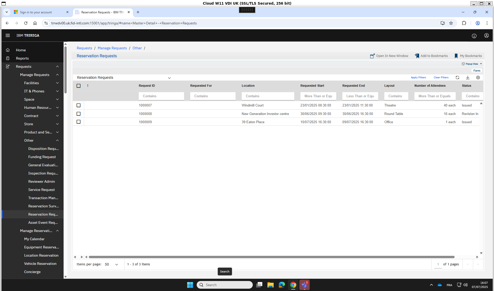
  <figcaption><strong>Screenshot:</strong> Invalid Duration Recorded</figcaption>
</figure>

<figure>
  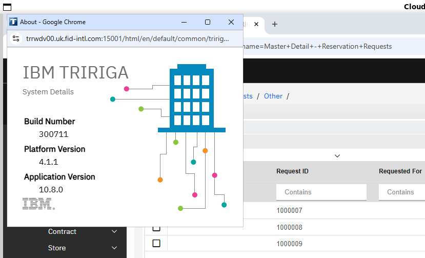
  <figcaption><strong>Screenshot:</strong> Invalid Duration Recorded</figcaption>
</figure>

**Recommendations:**

- Add validation rules to the BO to prevent reversed dates
- Display real-time UI error before form submission
- Audit duration formula and calendar sync logic

---

### ✅ UT009 – Validate Associated Service Requests (Equipment / Catering)

**Area:** <span style="color:blue; font-weight:bold;">Task & Service Integration</span>

**Purpose:**  
Verify whether selecting service options (e.g., Food Service Required, Equipment Required) during reservation creation correctly triggers the generation of related records (e.g., `triEquipmentOrder`, `triFoodServiceLineItem`), as intended by the system design.

**Why It Matters:**  
Reservations that include service needs must initiate downstream fulfillment processes. Failure to do so disrupts catering/equipment logistics, breaks automation expectations, and undermines audit reliability.

**Status:** ✅ PASSED

**Validation Steps:**

- Navigated to: My Requests > Location Reservation
- Searched for available workspaces
- Selected a space and created a reservation

- ✅ Checked Food Service Required and Equipment Required

- ✅ Submitted the reservation

**Observed Results:**

✅ Upon submission, the system generated the expected related records:

`triEquipmentOrder`

`triFoodServiceLineItem`

✅ These records are visible and traceable under the associated reservation

✅ Related tasks appear in My Requests and are properly linked

**Investigation Findings:**

- ✅ The `triReservation` BO includes defined associations to:
  - `triTask` (via Belongs To)
  - `triReserveWorkTask` (via Belongs To)
  - `triEquipmentOrder` (via Has)
  - `triFoodServiceLineItem` (via Has)

**Screenshot:**  

<figure>
  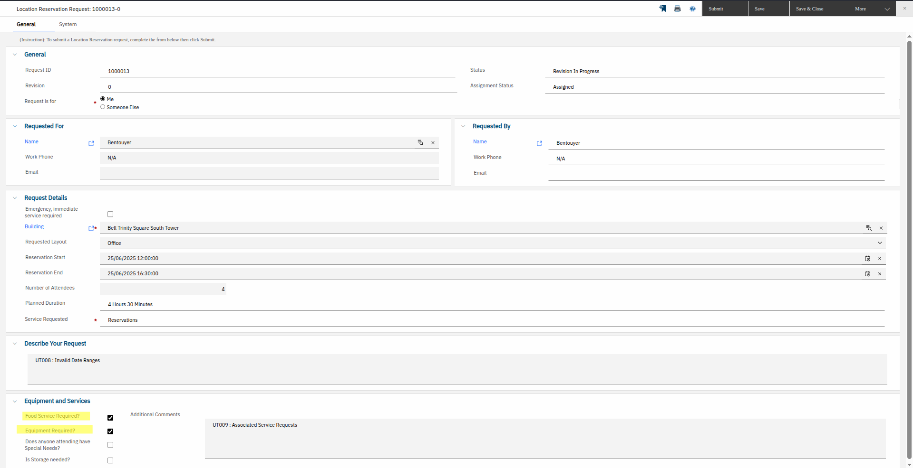
  <figcaption><strong>Screenshot:</strong> Reservation with selected services</figcaption>
</figure>

<figure>
  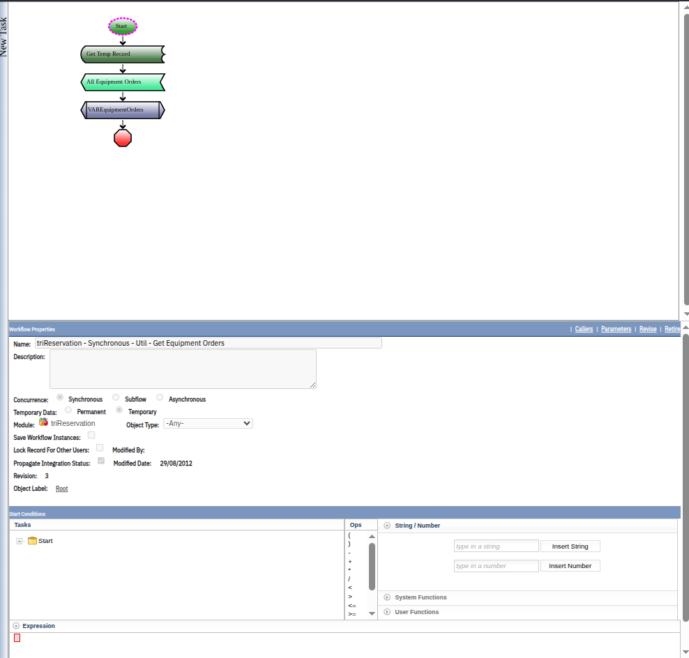
  <figcaption><strong>Screenshot:</strong> Workflow suspected</figcaption>
</figure>

<figure>
  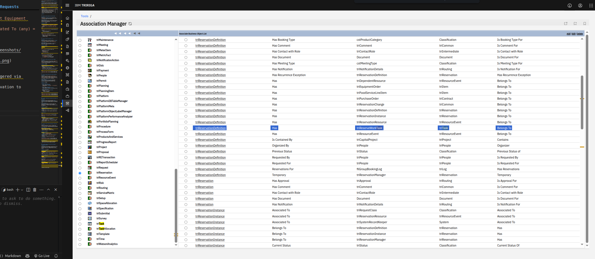
  <figcaption><strong>Screenshot:</strong> Structural Associations in triReservation: Task & Service Objects Mapped</figcaption>
</figure>

<figure>
  
  <figcaption><strong>Screenshot:</strong> Search & Booking Interface</figcaption>
</figure>

---

### ✅ UT010 – Validate Reservation Audit Trail Entries

**Area:** <span style="color:orange; font-weight:bold;">Audit & Reporting Accuracy</span>

**Purpose:**  
Ensure that reservation records maintain an accurate audit trail capturing who created, modified, and transitioned the record—along with relevant timestamps and states.

**Why It Matters:**  
Reliable audit trails are crucial for compliance, troubleshooting, and accountability—especially in workflows where multiple users or systems interact with reservations.

**Status:** ✅ PASSED

**Validation Steps:**

- Opened reservation ID: `1000013`
- Navigated to the **System** tab of the record form
- Verified audit data:
  - ✅ **Created Date/Time:** `19/06/2025 11:40:54`
  - ✅ **Modified Date/Time:** `23/06/2025 15:09:47`
  - ✅ **Modified By:** `Bentouyer, Souleiman - 1052887`
  - ✅ **Record State:** `triCompleted`
- Confirmed that audit trail reflects lifecycle progress (initial creation → review → completion)(#ut006--validate-reservation-lifecycle-integrity)

<figure>
  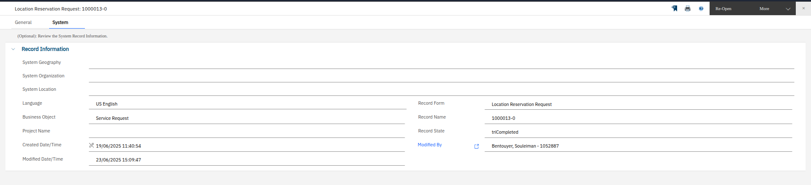
  <figcaption><strong>Screenshot:</strong> System Tab</figcaption>
</figure>

---

### ✅ UT011 – Validate Reservation Reporting Visibility and Export

**Area:** <span style="color:orange; font-weight:bold;">Audit & Reporting Accuracy</span>

**Purpose:**  
Ensure that reservation records created via UI or Data Integrator are visible in TRIRIGA reports and that Excel export functionality continues to work as expected post-migration.

**Why It Matters:**  
Reservations must be accessible via reporting tools for audit, analytics, and operational workflows. Export ensures portability and analysis outside the system.

**Status:** ✅ PASSED

**Validation Steps:**

- Navigated to: `Tools > Report Manager`
- Filtered reports targeting reservation-related data
- Selected and executed the report
- Exported results to Excel

**Results:**

- ✅ Excel file downloaded successfully  
- ✅ File opened with correct formatting  
- ✅ Reservation data present and accurate  
- ✅ No corruption, encoding, or data mapping issues  

**Screenshots:**

<figure>
  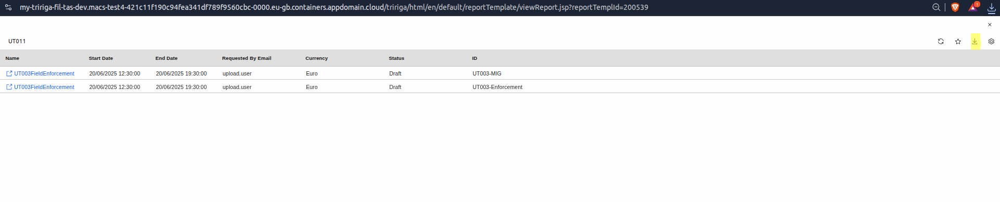
  <figcaption><strong>Screenshot:</strong> Report Manager – Reservation Report</figcaption>
</figure>

<figure>
  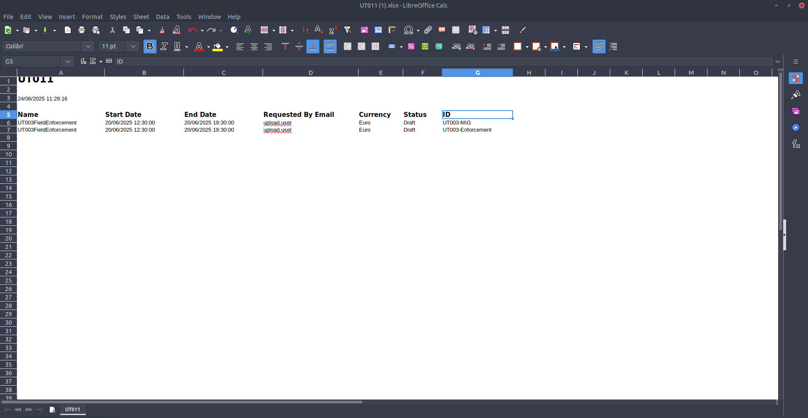
  <figcaption><strong>Screenshot:</strong> Excel Export – Reservation Report</figcaption>
</figure>

---

### ✅ UT012 – Validate Work Task Retrieval via OSLC API

**Area:** <span style="color:purple; font-weight:bold;">API & External Connectivity</span>

**Purpose:**  
Ensure that Work Task records (e.g., `triWorkTask`) are accessible via the TRIRIGA OSLC API using authorized requests.

**Why It Matters:**  
This validates the accessibility of key TRIRIGA objects for integration and automation via OSLC/RESTful endpoints — a foundational capability for external toolchains (like Postman, scripting, or third-party systems).

**Status:** ✅ PASSED

**Validation Steps:**

- Method: `GET`  
- Endpoint:  
  `https://https://my-tririga-fil-tas-dev.macs-test4-421c11f190c94fea341df789f9560cbc-0000.eu-gb.containers.appdomain.cloud/tririga/html/en/default/platform/mainpagepopout/mainpagepopout.jsp/tririga/oslc/so/triWorkTaskRS/31304255`
  
  _(example: `/31304255` from record created earlier)_
- Auth: Basic (user: `system`)
- Tool Used: Postman

**Response Details:**

- ✅ `spi_wm:schedstart`: `2025-06-19T14:28:11.850-07:00`  
- ✅ `dcterms:title`: `U005reservTask`  
- ✅ `spi_wm:status`: `Draft`  
- ✅ `spi:triCreatedSY`: `2025-06-19T14:28:11.801-07:00`  
- ✅ Response Code: `200 OK`

**Screenshots:**

<figure>
  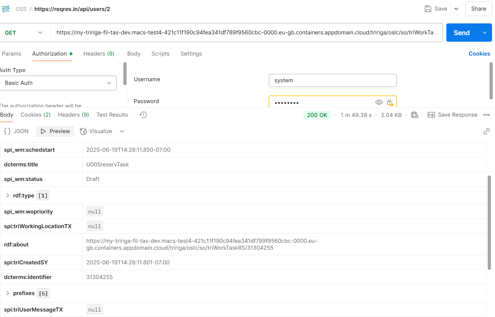
  <figcaption><strong>Screenshot:</strong> API GET Request in Postman</figcaption>
</figure>

<figure>
  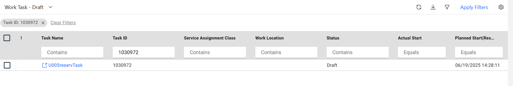
  <figcaption><strong>Screenshot:</strong> Work Task in TRIRIGA UI (matching Title/Status)</figcaption>
</figure>

<figure>
  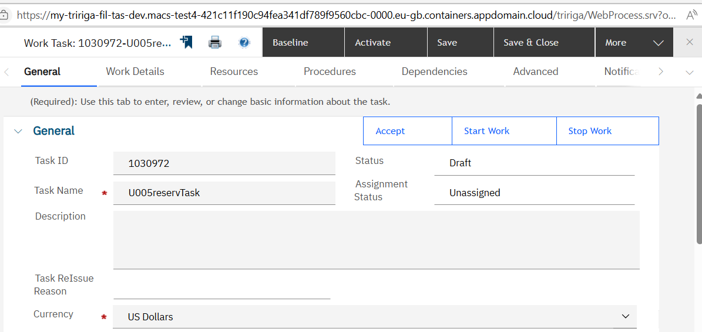
  <figcaption><strong>Screenshot:</strong> Work Task in TRIRIGA UI (matching Title/Status)</figcaption>
</figure>

---

### ✅ UT013 – Create Work Task via API (OSLC)

**Area:** <span style="color:purple; font-weight:bold;">API & External Connectivity</span>

**Purpose:**  
Verify that TRIRIGA’s OSLC API endpoint for triWorkTaskCF correctly accepts a POST request to create a new Work Task and that the record appears and behaves correctly in the UI.

**Why It Matters:**  
This test validates that external systems and automation tools can create Work Tasks programmatically — essential for integrations, ticketing pipelines, and DevOps workflows.

**Status:** ✅ PASSED

**Validation Steps:**

- Tool Used: Postman
- Method: `POST`  
- Endpoint:  
  `https://my-tririga-fil-tas-dev.macs-test4-421c11f190c94fea341df789f9560cbc-0000.eu-gb.containers.appdomain.cloud/tririga/oslc/so/triWorkTaskCF`
  
**Request Body (JSON):**

```json
{
  "spi:triTaskTypeCL": "Corrective",
  "dcterms:title": "UT015APITEST",
  "spi:action": "Create Draft"
}
```

**Results:**

| ✅ Validation Point                                              | Outcome |
| --------------------------------------------------------------- | ------- |
| API responded with `201 Created`                                | ✅       |
| Task created with ID `1030982` and title `UT015APITEST`         | ✅       |
| Record appears in **Work Task – Draft** report                  | ✅       |
| Fields `triTaskTypeCL`, `triStatusCL`, `triCreatedSY` populated | ✅       |
| Record is editable and passes UI validation                     | ✅       |

**Screenshots:**

<figure>
  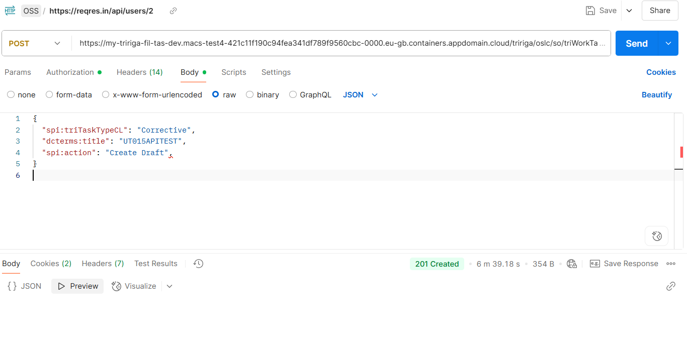
  <figcaption><strong>Screenshot:</strong> Postman request – Create Work Task</figcaption>
</figure>

<figure>
  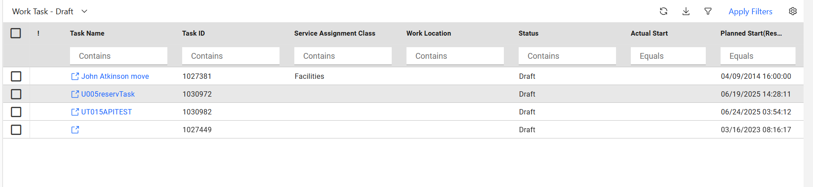
  <figcaption><strong>Screenshot:</strong> Work Task in Draft list</figcaption>
</figure>

<figure>
  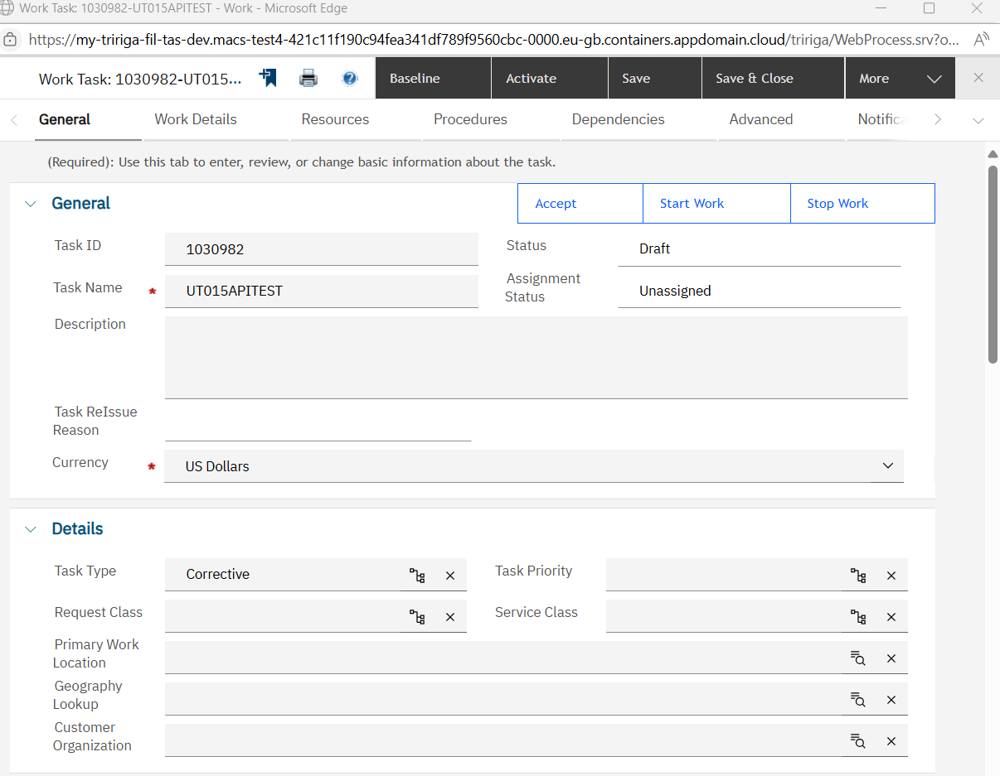
  <figcaption><strong>Screenshot:</strong> Work Task in TRIRIGA UI</figcaption>
</figure>

---

## 📌 Summary – Unit Testing Outcome

✅ **Confirmed Capabilities**

- Data Model Deployment: Objects like triReservation and triTask are deployed and structurally intact.

- Data Ingestion Stability: Legacy and new reservation records upload correctly via Data Integrator, with validations enforced.

- UI & Workflow Integrity: The TRIRIGA UI supports reservation creation, and lifecycle transitions function as expected.

- Audit & Reporting: Audit trails are preserved, and records are fully visible/exportable via Report Manager.

- API Reliability: Work Tasks can be created and retrieved via OSLC, supporting integration scenarios.

- Service Linkage: Task and reservation relationships are preserved and validated in UI and system associations.

© 2025 MACS – QA/Test Report
