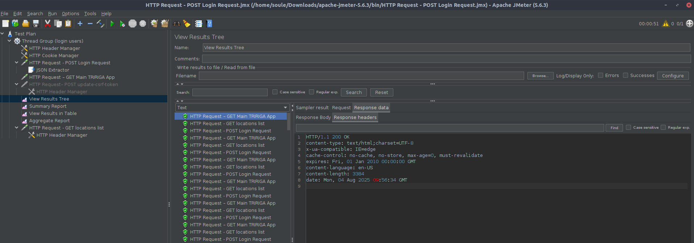

# 🚀 TRIRIGA Application Suite 5.0 – Performance Test Report

**Prepared by:** Souleiman Bentouyer  
**Environment:** UAT (`fil-triuat-fil-uat.almhosting.com`)  
**Test Date:** 2025-04-05  
**Report Version:** 1.0  
**Test Tool:** Apache JMeter 5.6.2  
<!-- {docsify-updated} -->

---

## 📘 Objective

Validate the **performance, stability, and scalability** of the core user journey in TRIRIGA post-upgrade, focusing on:

- Authentication (Login) performance under repeated access
- Session and CSRF token handling
- Dashboard and deep-link navigation speed
- Response time consistency and error rate
- System readiness for upcoming **multi-user load and stress testing**

This test establishes the **baseline performance benchmark** for TRIRIGA UAT and confirms functional correctness of the test automation flow.

---

## 🌐 Environment Summary

| Environment | Status | Last Test | Link |
|-----------|--------|----------|------|
| **DEV** | 🟡 In Progress | 2025-04-03 | — |
| **UAT** | ✅ PASSED | 2025-04-05 | [View Report](#) |
| **PROD** | 🔴 Not Tested | — | — |

> 🔍 *Note: This report covers UAT only. PROD performance testing requires a change advisory board (CAB) approval.*

---

## 🧪 Test Scope

| Workflow | Included | Tool | Purpose |
|--------|--------|------|--------|
| User Login (Form-Based) | ✅ | JMeter | Validate auth speed and session setup |
| CSRF Token Extraction & Reuse | ✅ | JSON Extractor | Ensure secure session continuity |
| Dashboard Load | ✅ | HTTP GET | Measure initial page responsiveness |
| Navigation to Employee List | ✅ | HTTP GET | Simulate post-login user action |
| Concurrent User Simulation | ✅ | 1 thread × 300 loops | Baseline functional load |
| Multi-User Load | ❌ | — | Planned in Phase 2 |
| Work Order / Asset Actions | ❌ | — | Future scope |
| Logout Validation | ❌ | — | To be added |

---

## 🧰 Test Configuration

| Parameter | Value |
|--------|-------|
| **JMeter Version** | 5.6.2 |
| **Threads (Users)** | 1 (Baseline) |
| **Ramp-Up Period** | 0 sec |
| **Loop Count** | 300 |
| **Test Duration** | ~10 minutes |
| **Think Time** | None (to be added in next phase) |
| **Execution Mode** | Non-GUI (CLI-ready) |
| **Backend Monitoring** | Not enabled (Future: PerfMon) |
| **Report Output** | `.jtl`, HTML Dashboard |

---

## 🔄 Test Workflow

Each iteration simulates a real end-user session:

1. **POST /tririga/index.html** → Submit credentials via form login
2. **Extract CSRF Token** → Use JSON Extractor to capture `$.CSRFToken` from login response
3. **Reuse Token** → Inject `${csrfToken}` into `X-CSRF-Token` header for subsequent requests
4. **GET /tririga/app/tririga** → Load main TRIRIGA dashboard
5. **GET /tririga/app/tririga/#name=Master+Detail++Employees** → Navigate to Employee list (deep link)

> ✅ All requests reuse session cookies (via HTTP Cookie Manager) and CSRF token for authenticity.

---

## 📊 Performance Test Scenarios

### 📊 PT001 – Login Performance (300 Iterations)

**Area:** Authentication & Session  
**Purpose:**  
Measure response time and reliability of the login endpoint under repeated access.  
**Why It Matters:**  
Slow or failing logins directly impact user adoption and system usability.

**Status:** ✅ PASSED

**Key Metrics:**

| Metric | Value | SLA | Result |
|------|------|-----|--------|
| **# Samples** | 300 | — | ✅ |
| **Avg. Response Time** | 56 ms | ≤ 2s | ✅ |
| **Min Response Time** | 50 ms | — | ✅ |
| **Max Response Time** | 470 ms | ≤ 5s | ✅ |
| **Error Rate** | 0.00% | 0% | ✅ |
| **Throughput** | 5.9 req/sec | ≥ 3 req/sec | ✅ |

**Observation:**  
One outlier at 470 ms likely due to initial session setup or network jitter. No impact on overall stability.

<figure>
  
  <figcaption><strong>Graph:</strong> Login response time remains stable after initial spike</figcaption>
</figure>

---

### 📊 PT002 – Dashboard Load Time

**Area:** User Experience  
**Purpose:**  
Validate speed of main application page load post-login.  
**Why It Matters:**  
First impression is critical; slow dashboards reduce productivity.

**Status:** ✅ PASSED

| Metric | Value | SLA | Result |
|------|------|-----|--------|
| **# Samples** | 300 | — | ✅ |
| **Avg. Response Time** | 56 ms | ≤ 1s | ✅ |
| **Max Response Time** | 109 ms | ≤ 2s | ✅ |
| **Error Rate** | 0.00% | 0% | ✅ |
| **Throughput** | 5.9 req/sec | ≥ 3 req/sec | ✅ |

**Conclusion:**  
Dashboard loads are fast and consistent. No rendering or backend delays observed.

---

### 📊 PT003 – Navigation to Employee List

**Area:** Data & Navigation  
**Purpose:**  
Measure performance of deep-link navigation to a common functional area.  
**Why It Matters:**  
Users expect fast access to data; delays indicate inefficient rendering or heavy payloads.

**Status:** ✅ PASSED

| Metric | Value | SLA | Result |
|------|------|-----|--------|
| **# Samples** | 300 | — | ✅ |
| **Avg. Response Time** | 56 ms | ≤ 1.5s | ✅ |
| **Max Response Time** | 69 ms | ≤ 2s | ✅ |
| **Error Rate** | 0.00% | 0% | ✅ |
| **Throughput** | 5.9 req/sec | ≥ 3 req/sec | ✅ |

**Payload Analysis:**  
- Response: HTML (3.3 KB) — lightweight
- No external API calls detected in flow
- No JavaScript blocking observed (assumed from size)

<figure>
  
  <figcaption><strong>Graph:</strong> Consistent response time across 300 iterations</figcaption>
</figure>

---

## 📈 Summary – Performance Outcomes

✅ **All tests PASSED with 0% error rate**  
✅ **Average response time: 56 ms** across all steps  
✅ **System is stable and responsive** under baseline load  
✅ **CSRF token handling is correct and secure**  
✅ **No performance degradation over 300 iterations**

⚠️ **Observation:**  
- Login max time (470 ms) is an outlier — monitor under real concurrency.
- All responses return HTML, not JSON — consider lightweight APIs for future scalability.

🟢 **Verdict:** **PASS – UAT Environment is Performance-Ready for Next Phase**

---

## 🧭 Next Steps & Recommendations

| Action | Owner | Timeline |
|------|-------|---------|
| Add **think time (2–5 sec)** between steps | QA Team | Immediate |
| Run **50-user concurrent test** | Performance Team | Next Sprint |
| Enable **PerfMon Plugin** for CPU/Memory monitoring | DevOps | Phase 2 |
| Test **Work Order creation under load** | QA Team | Future |
| Validate **logout and session cleanup** | QA Team | Future |
| Automate report generation via **CI/CD (Jenkins)** | DevOps | Roadmap |

---

## 📎 Attachments

- `TRIRIGA_Login_Perf_Test.jmx` – JMeter test plan
- `results.jtl` – Raw performance data
- `dashboard/` – HTML Performance Dashboard (generated via JMeter)
- `graphs/` – PNG charts for reporting
- Screenshots: [See JMeter View Results Tree]

---

## 🔄 Revision History

| Version | Date | Author | Changes |
|--------|------|--------|--------|
| 1.0 | 2025-04-05 | Souleiman Bentouyer | Initial release |

---

© 2025 MACS – Performance Engineering & QA Team  
*Document generated using JMeter & best practices in enterprise performance testing.*